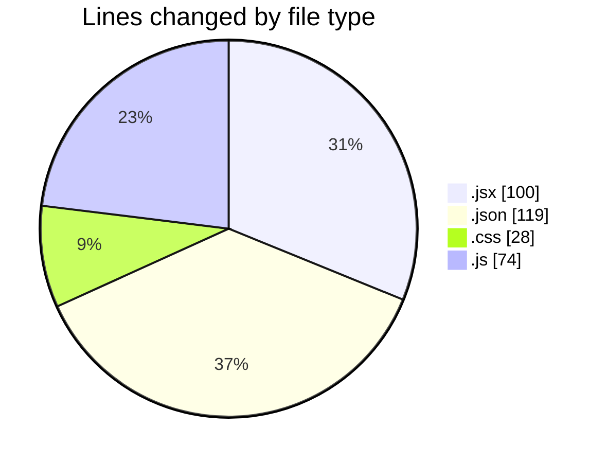
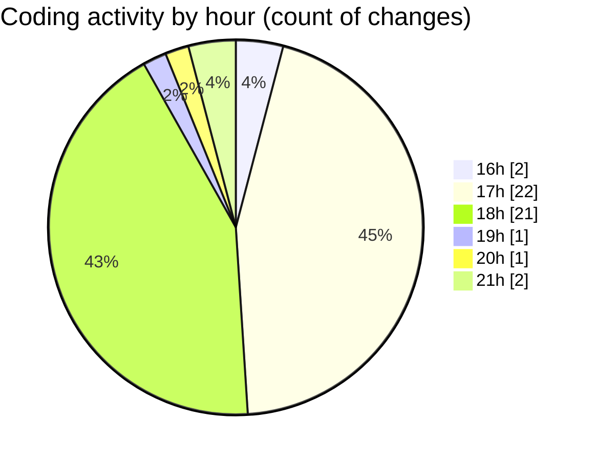

# React - Activity Summary 

## Overall Statistics

| Stat                   | Value                                                             |
| ---------------------- | ----------------------------------------------------------------- |
| **Lines Added** (➕)   | 296                                          |
| **Lines Removed** (➖) | 25                                        |
| **Net Change** (↕)    | 271                |
| **Active Time** (⌚)   | 60 minutes |

## Modified Files
- **Color.jsx** (+25, -4)
- **settings.json** (+3, -0)
- **App.jsx** (+16, -1)
- **Color.css** (+24, -4)
- **Counter.jsx** (+37, -16)
- **keybindings.json** (+65, -0)
- **settings.json** (+51, -0)
- **data.js** (+74, -0)
- **Info.jsx** (+1, -0)

## Visualizations

### By File Type (Lines Changed)

### By Hour (Estimated Activity Count)

> **Last Updated:** 1/24/2025, 9:03:36 PM