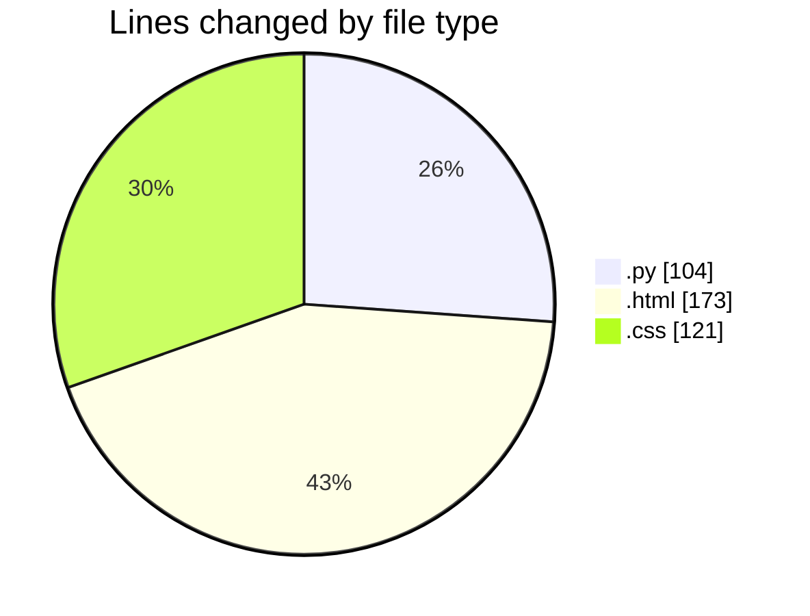
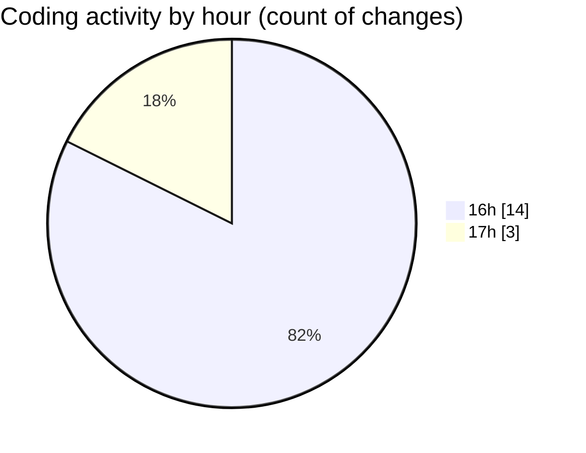

# flask - Activity Summary 

## Overall Statistics

| Stat                   | Value                                                             |
| ---------------------- | ----------------------------------------------------------------- |
| **Lines Added** (➕)   | 367                                          |
| **Lines Removed** (➖) | 31                                        |
| **Net Change** (↕)    | 336                |
| **Active Time** (⌚)   | 17 minutes |

## Modified Files
- **app.py** (+104, -0)
- **index.html** (+60, -31)
- **register.html** (+27, -0)
- **receipt.html** (+20, -0)
- **payment.html** (+35, -0)
- **style.css** (+121, -0)

## Visualizations

### By File Type (Lines Changed)

### By Hour (Estimated Activity Count)

> **Last Updated:** 1/31/2025, 5:05:58 PM