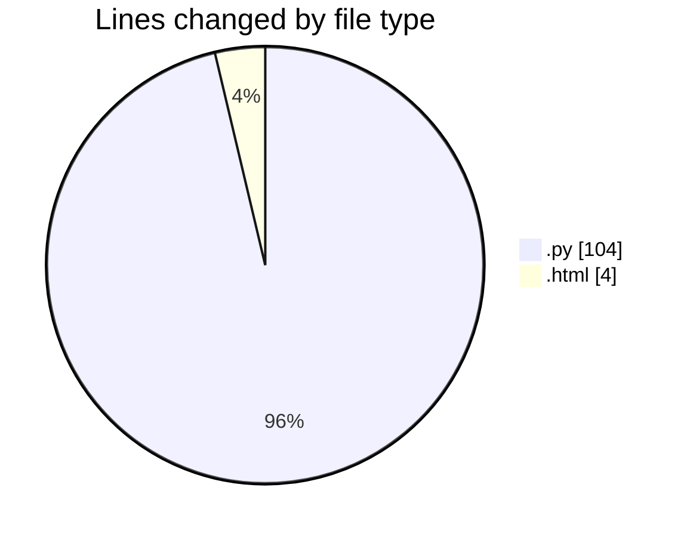
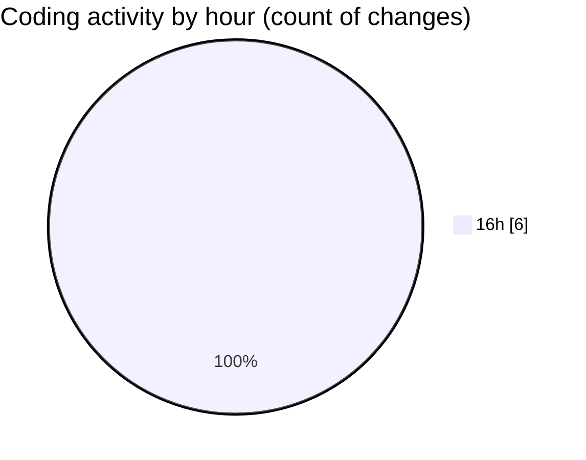

# flask - Activity Summary 

## Overall Statistics

| Stat                   | Value                                                             |
| ---------------------- | ----------------------------------------------------------------- |
| **Lines Added** (➕)   | 108                                          |
| **Lines Removed** (➖) | 0                                        |
| **Net Change** (↕)    | 108                |
| **Active Time** (⌚)   | 3 minutes |

## Modified Files
- **app.py** (+104, -0)
- **index.html** (+1, -0)
- **register.html** (+1, -0)
- **receipt.html** (+1, -0)
- **payment.html** (+1, -0)

## Visualizations

### By File Type (Lines Changed)

### By Hour (Estimated Activity Count)

> **Last Updated:** 1/31/2025, 4:40:58 PM