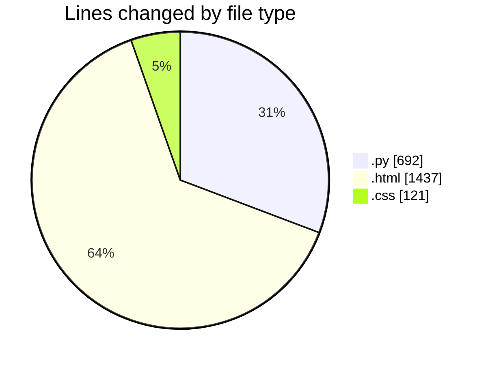
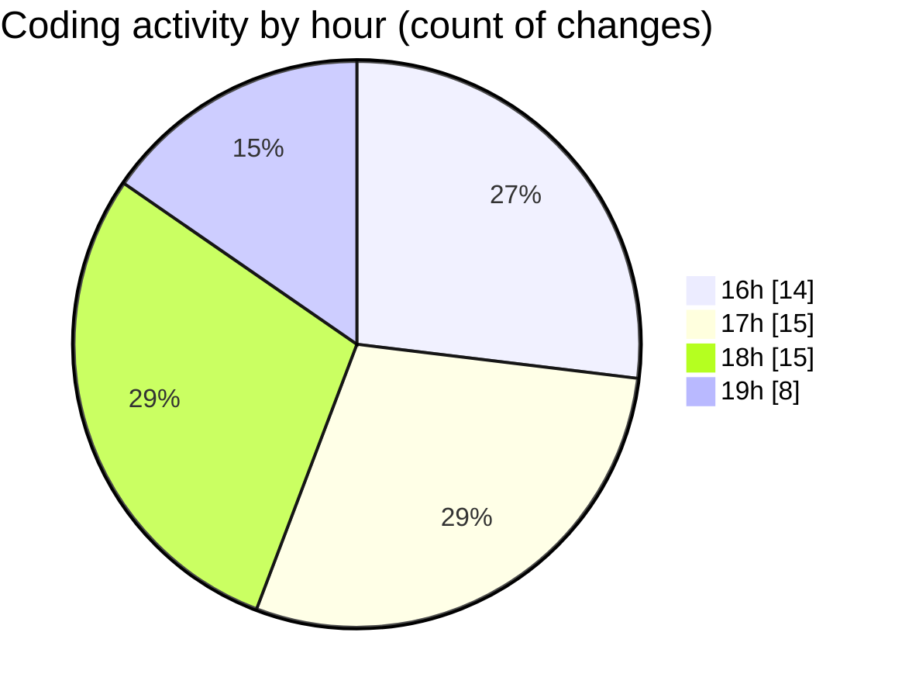

# flask - Activity Summary 

## Overall Statistics

| Stat                   | Value                                                             |
| ---------------------- | ----------------------------------------------------------------- |
| **Lines Added** (➕)   | 1963                                          |
| **Lines Removed** (➖) | 287                                        |
| **Net Change** (↕)    | 1676                |
| **Active Time** (⌚)   | 69 minutes |

## Modified Files
- **app.py** (+692, -0)
- **index.html** (+483, -274)
- **register.html** (+90, -0)
- **receipt.html** (+282, -13)
- **payment.html** (+295, -0)
- **style.css** (+121, -0)

## Visualizations

### By File Type (Lines Changed)

### By Hour (Estimated Activity Count)

> **Last Updated:** 1/31/2025, 7:29:21 PM