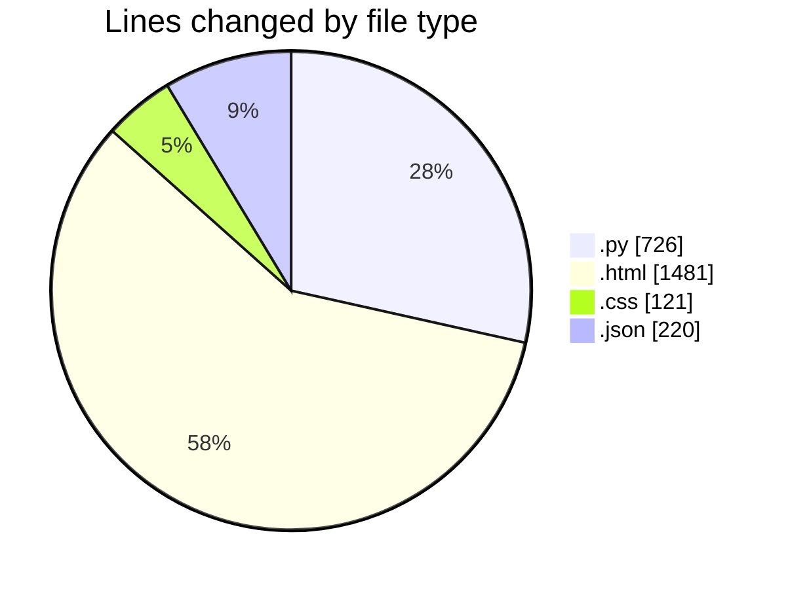
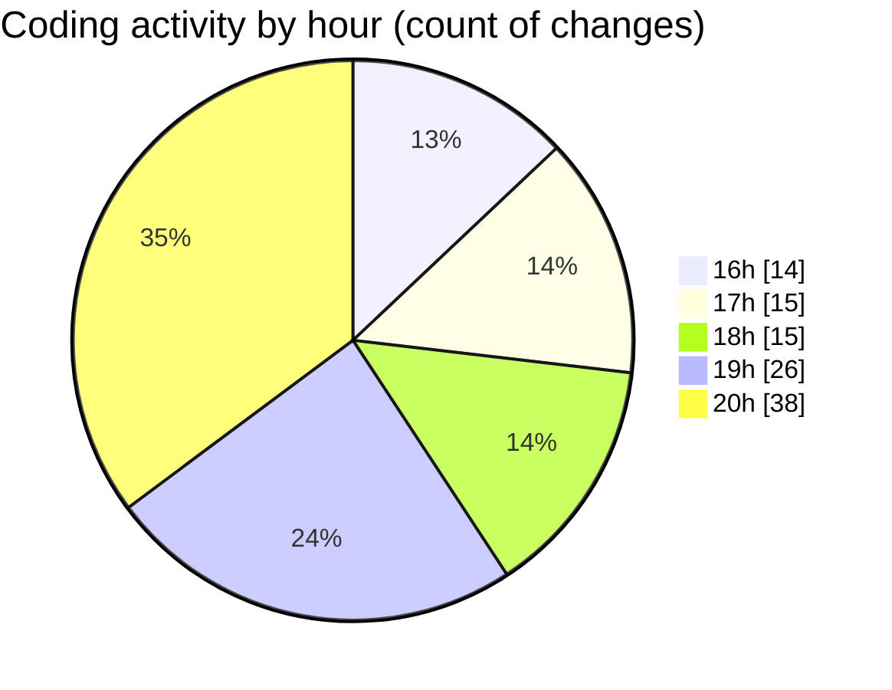

# flask - Activity Summary 

## Overall Statistics

| Stat                   | Value                                                             |
| ---------------------- | ----------------------------------------------------------------- |
| **Lines Added** (➕)   | 2145                                          |
| **Lines Removed** (➖) | 403                                        |
| **Net Change** (↕)    | 1742                |
| **Active Time** (⌚)   | 140 minutes |

## Modified Files
- **app.py** (+726, -0)
- **index.html** (+483, -274)
- **register.html** (+90, -0)
- **receipt.html** (+282, -13)
- **payment.html** (+295, -44)
- **style.css** (+121, -0)
- **settings.json** (+17, -0)
- **settings.json** (+131, -72)

## Visualizations

### By File Type (Lines Changed)

### By Hour (Estimated Activity Count)

> **Last Updated:** 1/31/2025, 8:59:22 PM