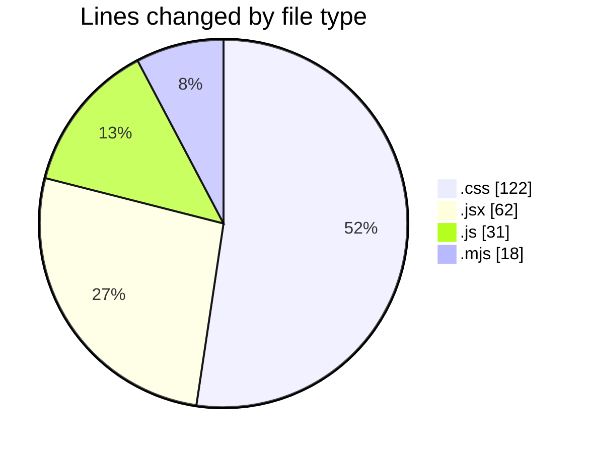
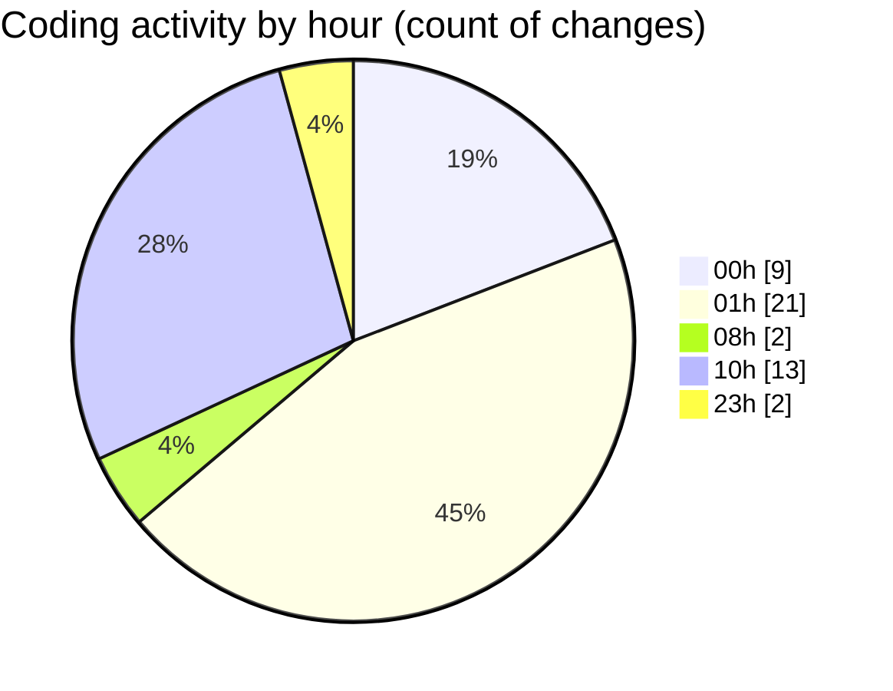

# React - Activity Summary 

## Overall Statistics

| Stat                   | Value                                                             |
| ---------------------- | ----------------------------------------------------------------- |
| **Lines Added** (➕)   | 204                                          |
| **Lines Removed** (➖) | 29                                        |
| **Net Change** (↕)    | 175                |
| **Active Time** (⌚)   | 56 minutes |

## Modified Files
- **Meals.css** (+41, -8)
- **Accordion.jsx** (+25, -0)
- **App.jsx** (+26, -0)
- **Acc.css** (+52, -15)
- **Form.jsx** (+11, -0)
- **postcss.config.js** (+7, -0)
- **index.css** (+6, -0)
- **tailwind.config.js** (+12, -0)
- **vite.config.js** (+12, -0)
- **postcss.config.mjs** (+12, -6)

## Visualizations

### By File Type (Lines Changed)

### By Hour (Estimated Activity Count)

> **Last Updated:** 1/31/2025, 10:38:43 AM