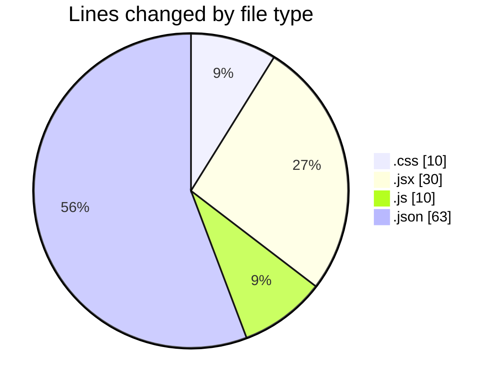
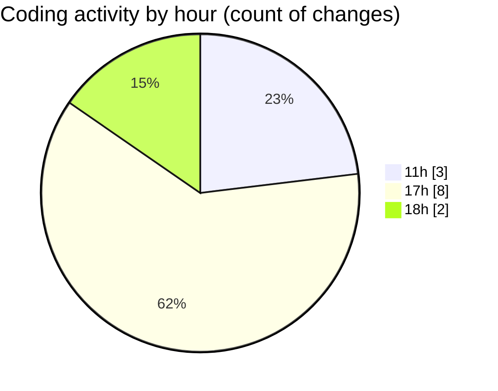

# React - Activity Summary 

## Overall Statistics

| Stat                   | Value                                                             |
| ---------------------- | ----------------------------------------------------------------- |
| **Lines Added** (➕)   | 110                                          |
| **Lines Removed** (➖) | 3                                        |
| **Net Change** (↕)    | 107                |
| **Active Time** (⌚)   | 10 minutes |

## Modified Files
- **index.css** (+6, -2)
- **App.jsx** (+30, -0)
- **vite.config.js** (+10, -0)
- **index.css** (+2, -0)
- **settings.json** (+62, -1)

## Visualizations

### By File Type (Lines Changed)

### By Hour (Estimated Activity Count)

> **Last Updated:** 2/5/2025, 6:08:52 PM