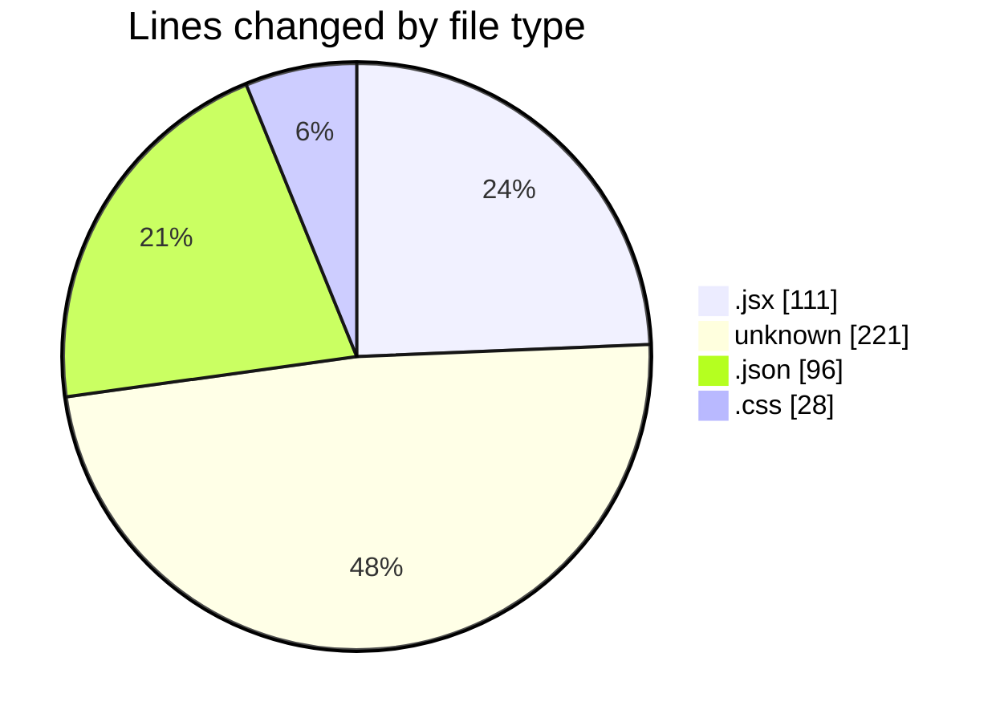
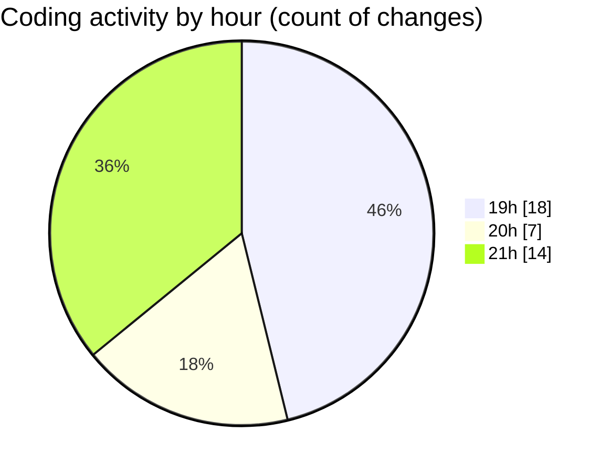

# React Ecom - Activity Summary 

## Overall Statistics

| Stat                   | Value                                                             |
| ---------------------- | ----------------------------------------------------------------- |
| **Lines Added** (➕)   | 445                                          |
| **Lines Removed** (➖) | 11                                        |
| **Net Change** (↕)    | 434                |
| **Active Time** (⌚)   | 42 minutes |

## Modified Files
- **Name.jsx** (+9, -0)
- **Category.jsx** (+9, -0)
- **Nav.jsx** (+70, -11)
- **App.jsx** (+12, -0)
- **COMMIT_EDITMSG** (+188, -0)
- **settings.json** (+64, -0)
- **.gitignore** (+33, -0)
- **package.json** (+32, -0)
- **index.css** (+28, -0)

## Visualizations

### By File Type (Lines Changed)

### By Hour (Estimated Activity Count)

> **Last Updated:** 2/5/2025, 9:37:43 PM