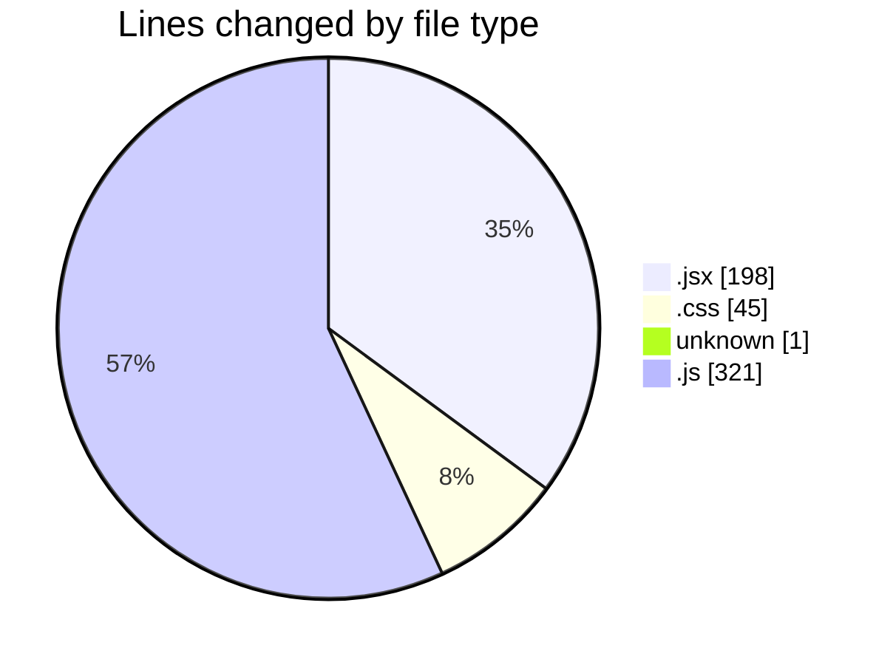
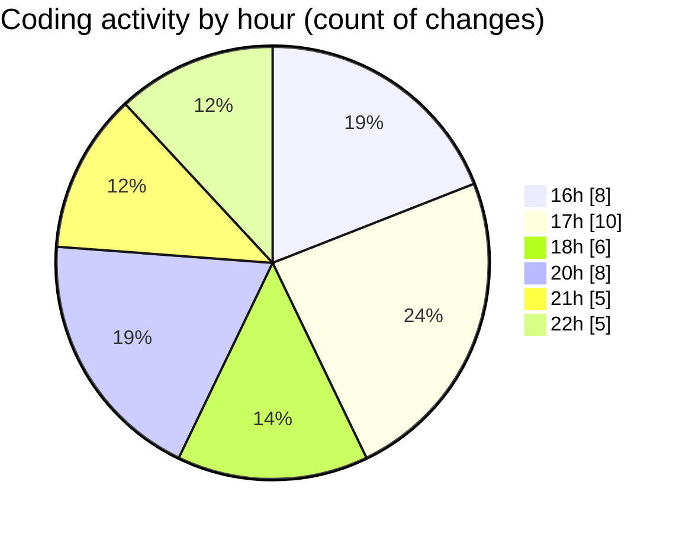

# React Ecom - Activity Summary 

## Overall Statistics

| Stat                   | Value                                                             |
| ---------------------- | ----------------------------------------------------------------- |
| **Lines Added** (➕)   | 520                                          |
| **Lines Removed** (➖) | 45                                        |
| **Net Change** (↕)    | 475                |
| **Active Time** (⌚)   | 53 minutes |

## Modified Files
- **Product.jsx** (+73, -38)
- **App.jsx** (+15, -0)
- **Nav.jsx** (+62, -1)
- **index.css** (+39, -6)
- **React** (+1, -0)
- **Price.jsx** (+9, -0)
- **data.js** (+321, -0)

## Visualizations

### By File Type (Lines Changed)

### By Hour (Estimated Activity Count)

> **Last Updated:** 2/6/2025, 10:34:33 PM