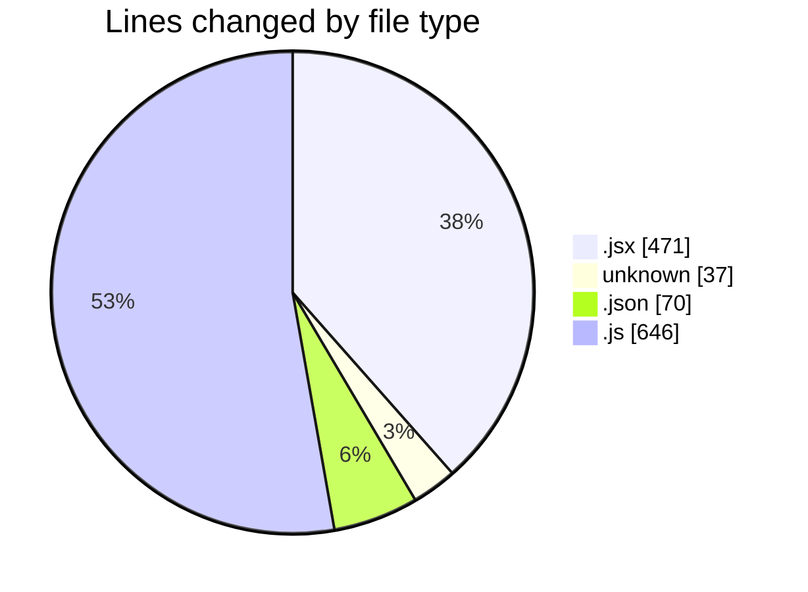
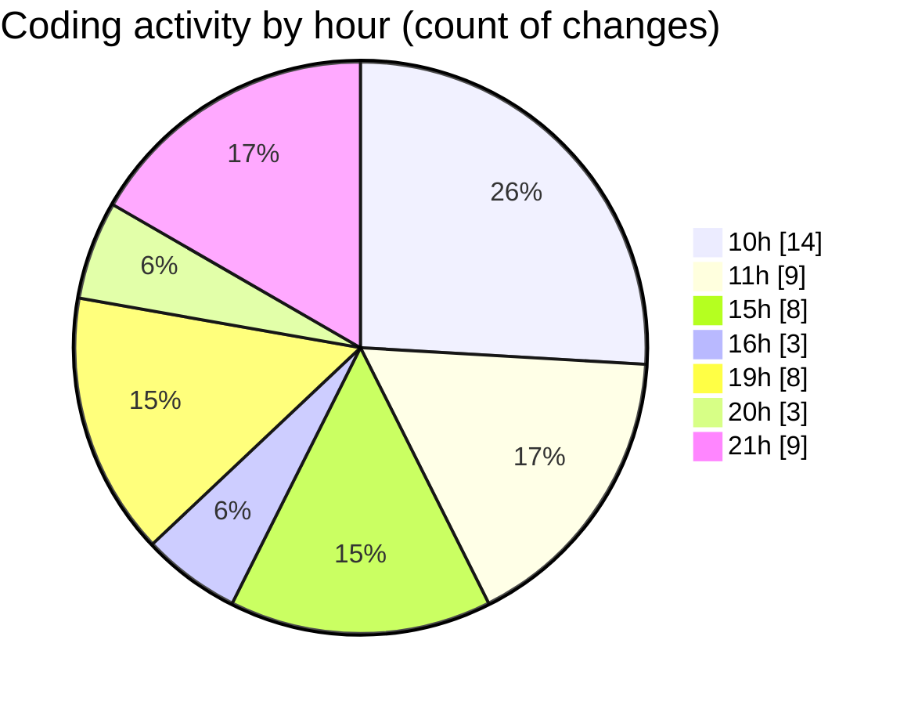

# React Ecom - Activity Summary 

## Overall Statistics

| Stat                   | Value                                                             |
| ---------------------- | ----------------------------------------------------------------- |
| **Lines Added** (➕)   | 1091                                          |
| **Lines Removed** (➖) | 133                                        |
| **Net Change** (↕)    | 958                |
| **Active Time** (⌚)   | 67 minutes |

## Modified Files
- **Product.jsx** (+270, -92)
- **.gitignore** (+35, -2)
- **settings.json** (+68, -2)
- **data.js** (+287, -36)
- **Products.js** (+322, -1)
- **Recon.jsx** (+20, -0)
- **App.jsx** (+19, -0)
- **Category.jsx** (+9, -0)
- **Nav.jsx** (+61, -0)

## Visualizations

### By File Type (Lines Changed)

### By Hour (Estimated Activity Count)

> **Last Updated:** 2/8/2025, 10:00:29 PM