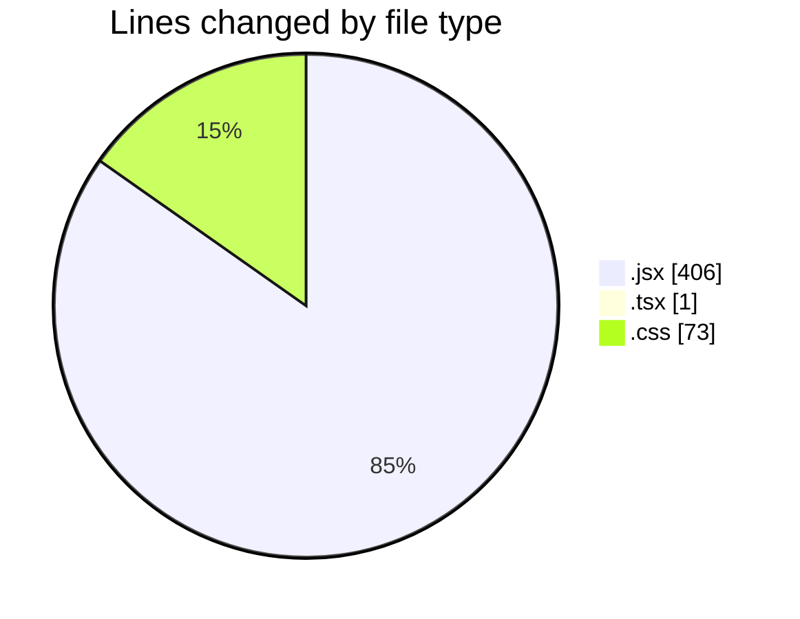
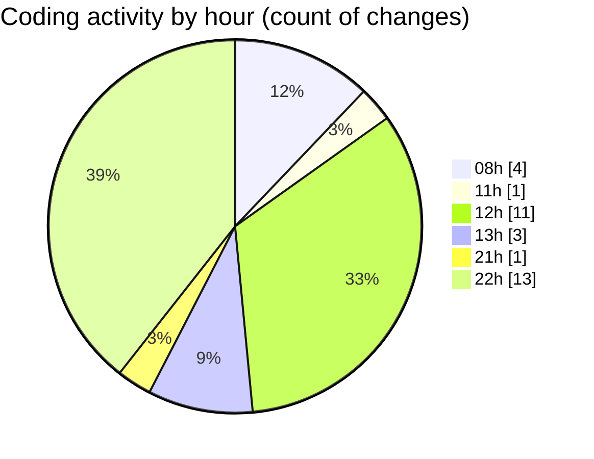

# React Ecom - Activity Summary 

## Overall Statistics

| Stat                   | Value                                                             |
| ---------------------- | ----------------------------------------------------------------- |
| **Lines Added** (➕)   | 449                                          |
| **Lines Removed** (➖) | 31                                        |
| **Net Change** (↕)    | 418                |
| **Active Time** (⌚)   | 49 minutes |

## Modified Files
- **Sidebar.jsx** (+50, -0)
- **Color.jsx** (+9, -0)
- **ProductRow.tsx** (+1, -0)
- **App.jsx** (+30, -4)
- **Nav.jsx** (+122, -0)
- **Category.jsx** (+61, -21)
- **Product.jsx** (+75, -0)
- **Recon.jsx** (+21, -2)
- **Input.jsx** (+11, -0)
- **index.css** (+69, -4)

## Visualizations

### By File Type (Lines Changed)

### By Hour (Estimated Activity Count)

> **Last Updated:** 2/10/2025, 10:50:18 PM