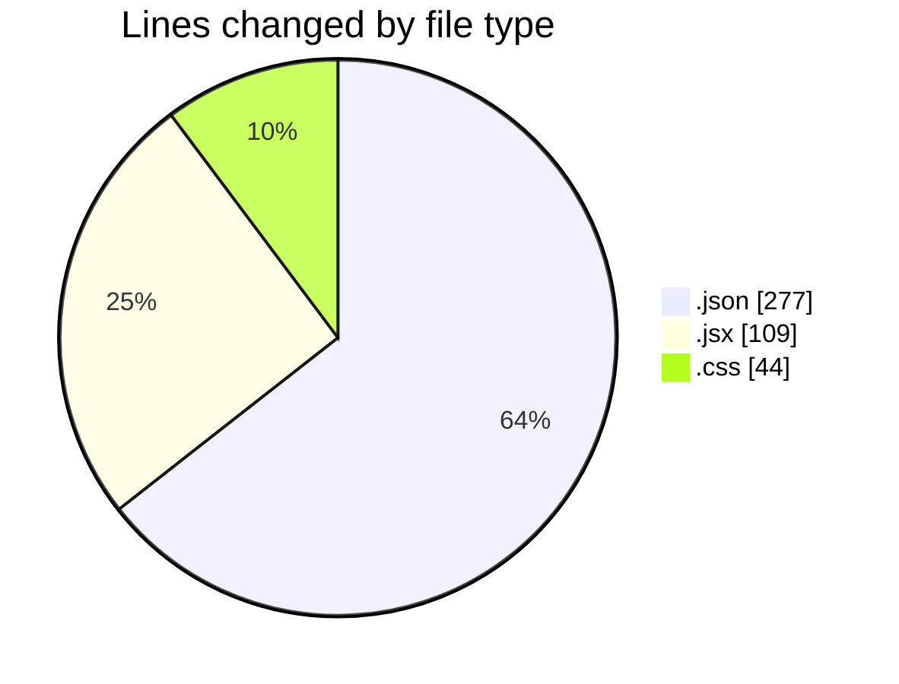
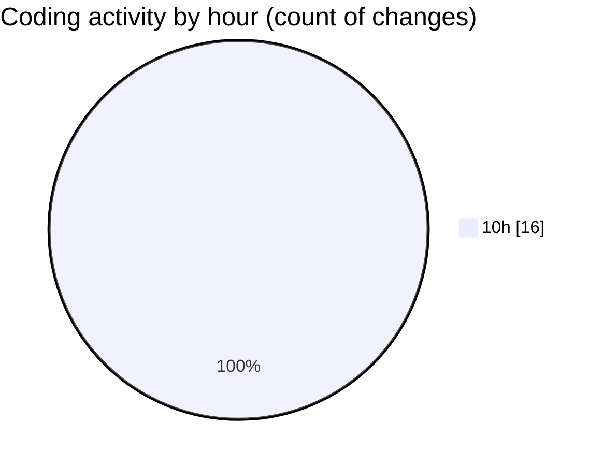

# React Ecom - Activity Summary 

## Overall Statistics

| Stat                   | Value                                                             |
| ---------------------- | ----------------------------------------------------------------- |
| **Lines Added** (➕)   | 429                                          |
| **Lines Removed** (➖) | 1                                        |
| **Net Change** (↕)    | 428                |
| **Active Time** (⌚)   | 12 minutes |

## Modified Files
- **settings.json** (+277, -0)
- **Price.jsx** (+52, -0)
- **Recon.jsx** (+21, -1)
- **Buttons.jsx** (+9, -0)
- **App.jsx** (+26, -0)
- **index.css** (+44, -0)

## Visualizations

### By File Type (Lines Changed)

### By Hour (Estimated Activity Count)

> **Last Updated:** 2/11/2025, 10:45:14 AM