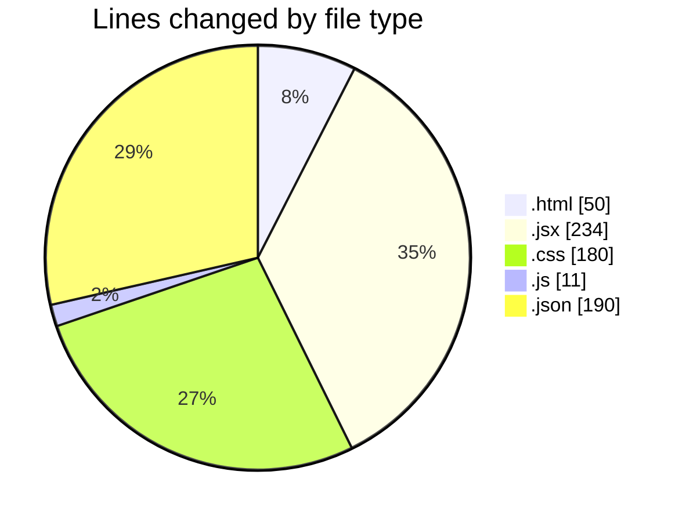
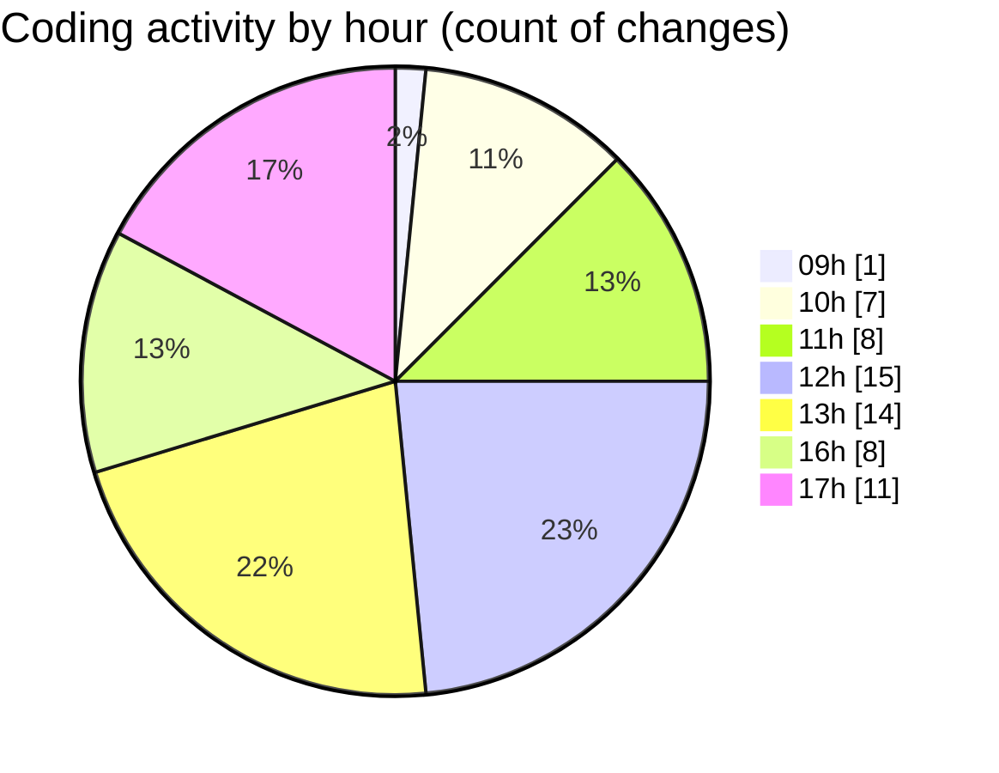

# EliteGPT - Activity Summary 

## Overall Statistics

| Stat                   | Value                                                             |
| ---------------------- | ----------------------------------------------------------------- |
| **Lines Added** (➕)   | 521                                          |
| **Lines Removed** (➖) | 144                                        |
| **Net Change** (↕)    | 377                |
| **Active Time** (⌚)   | 80 minutes |

## Modified Files
- **index.html** (+39, -11)
- **App.jsx** (+50, -27)
- **index.css** (+101, -79)
- **vite.config.js** (+11, -0)
- **Sidebar.jsx** (+26, -0)
- **Sidebar.jsx** (+31, -2)
- **NewChat.jsx** (+35, -21)
- **package.json** (+32, -0)
- **Hsitory.jsx** (+12, -0)
- **History.jsx** (+12, -0)
- **settings.json** (+155, -3)
- **History.jsx** (+17, -1)

## Visualizations

### By File Type (Lines Changed)

### By Hour (Estimated Activity Count)

> **Last Updated:** 2/12/2025, 5:54:32 PM