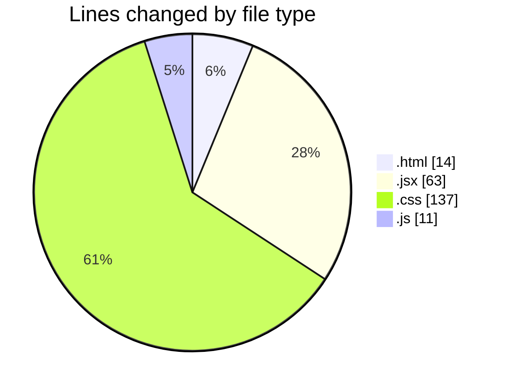
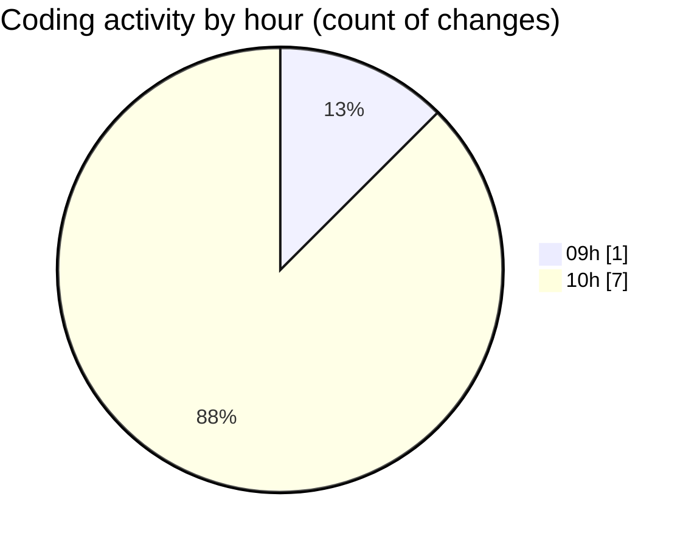

# EliteGPT - Activity Summary 

## Overall Statistics

| Stat                   | Value                                                             |
| ---------------------- | ----------------------------------------------------------------- |
| **Lines Added** (➕)   | 130                                          |
| **Lines Removed** (➖) | 95                                        |
| **Net Change** (↕)    | 35                |
| **Active Time** (⌚)   | 5 minutes |

## Modified Files
- **index.html** (+14, -0)
- **App.jsx** (+36, -27)
- **index.css** (+69, -68)
- **vite.config.js** (+11, -0)

## Visualizations

### By File Type (Lines Changed)

### By Hour (Estimated Activity Count)

> **Last Updated:** 2/12/2025, 10:44:38 AM