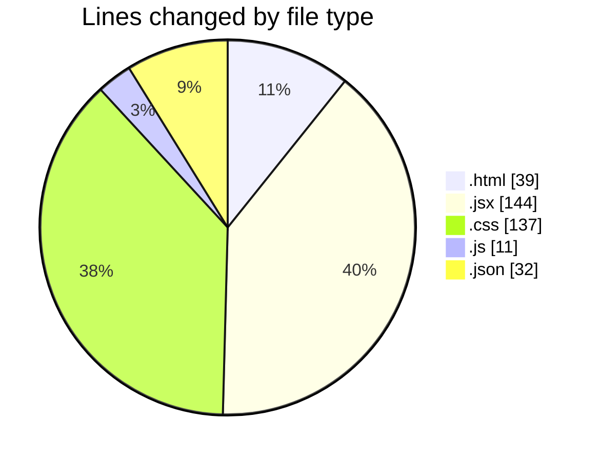
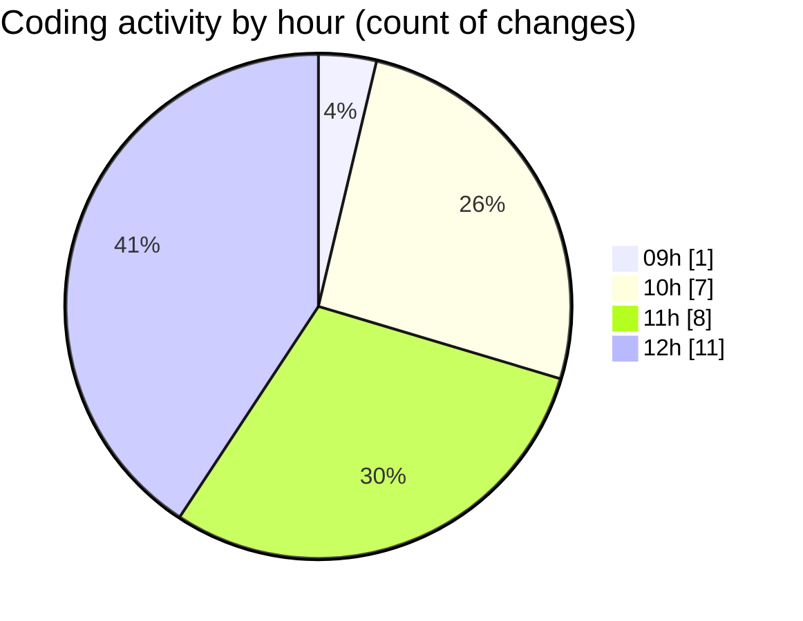

# EliteGPT - Activity Summary 

## Overall Statistics

| Stat                   | Value                                                             |
| ---------------------- | ----------------------------------------------------------------- |
| **Lines Added** (➕)   | 266                                          |
| **Lines Removed** (➖) | 97                                        |
| **Net Change** (↕)    | 169                |
| **Active Time** (⌚)   | 28 minutes |

## Modified Files
- **index.html** (+39, -0)
- **App.jsx** (+48, -27)
- **index.css** (+69, -68)
- **vite.config.js** (+11, -0)
- **Sidebar.jsx** (+26, -0)
- **Sidebar.jsx** (+27, -2)
- **NewChat.jsx** (+14, -0)
- **package.json** (+32, -0)

## Visualizations

### By File Type (Lines Changed)

### By Hour (Estimated Activity Count)

> **Last Updated:** 2/12/2025, 12:33:26 PM