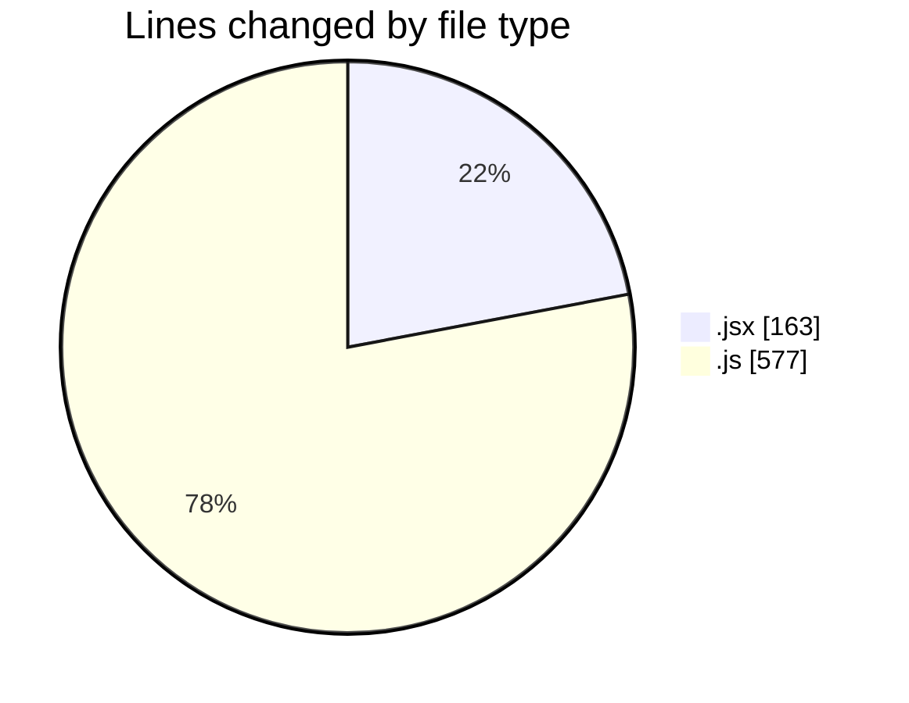
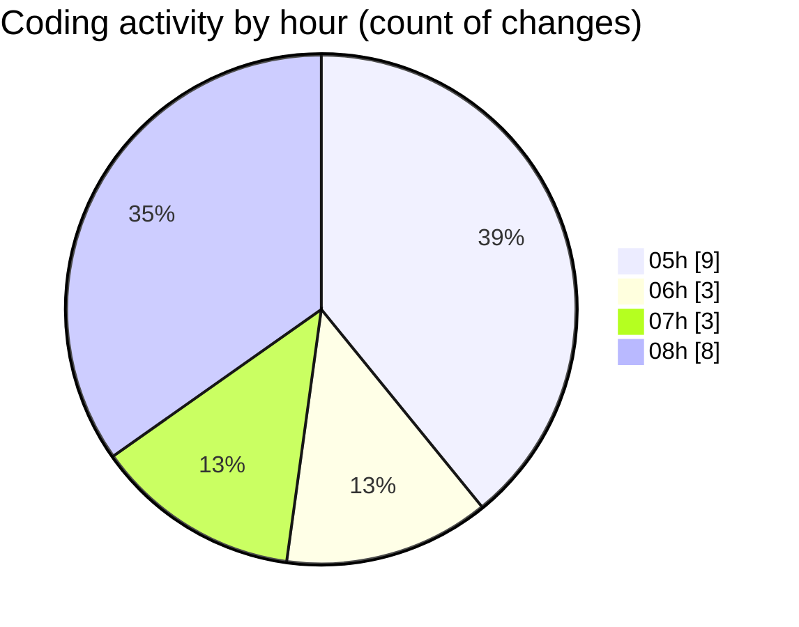

# React Ecom - Activity Summary 

## Overall Statistics

| Stat                   | Value                                                             |
| ---------------------- | ----------------------------------------------------------------- |
| **Lines Added** (➕)   | 721                                          |
| **Lines Removed** (➖) | 19                                        |
| **Net Change** (↕)    | 702                |
| **Active Time** (⌚)   | 36 minutes |

## Modified Files
- **App.jsx** (+122, -18)
- **Product.jsx** (+0, -1)
- **Sidebar.jsx** (+22, -0)
- **data.js** (+572, -0)
- **App.js** (+1, -0)
- **Nav.js** (+1, -0)
- **Color.js** (+1, -0)
- **Category.js** (+1, -0)
- **PriceRecon.js** (+1, -0)

## Visualizations

### By File Type (Lines Changed)

### By Hour (Estimated Activity Count)

> **Last Updated:** 2/12/2025, 8:53:35 AM