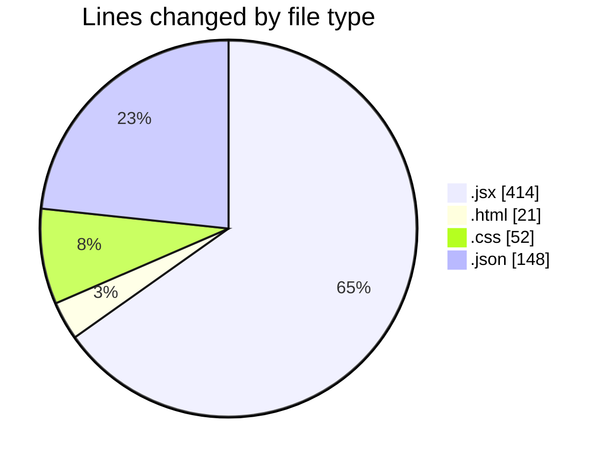
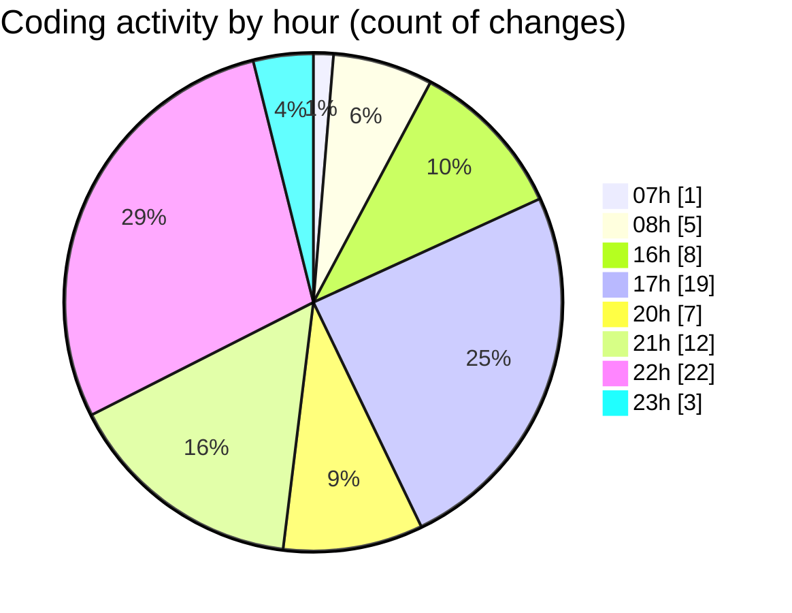

# EliteGPT - Activity Summary 

## Overall Statistics

| Stat                   | Value                                                             |
| ---------------------- | ----------------------------------------------------------------- |
| **Lines Added** (➕)   | 560                                          |
| **Lines Removed** (➖) | 75                                        |
| **Net Change** (↕)    | 485                |
| **Active Time** (⌚)   | 97 minutes |

## Modified Files
- **Sidebar.jsx** (+210, -32)
- **index.html** (+20, -1)
- **index.css** (+34, -18)
- **Bottom.jsx** (+57, -21)
- **Top.jsx** (+26, -0)
- **History.jsx** (+37, -1)
- **NewChat.jsx** (+16, -2)
- **settings.json** (+79, -0)
- **Main.jsx** (+12, -0)
- **keybindings.json** (+69, -0)

## Visualizations

### By File Type (Lines Changed)

### By Hour (Estimated Activity Count)

> **Last Updated:** 2/13/2025, 11:10:13 PM