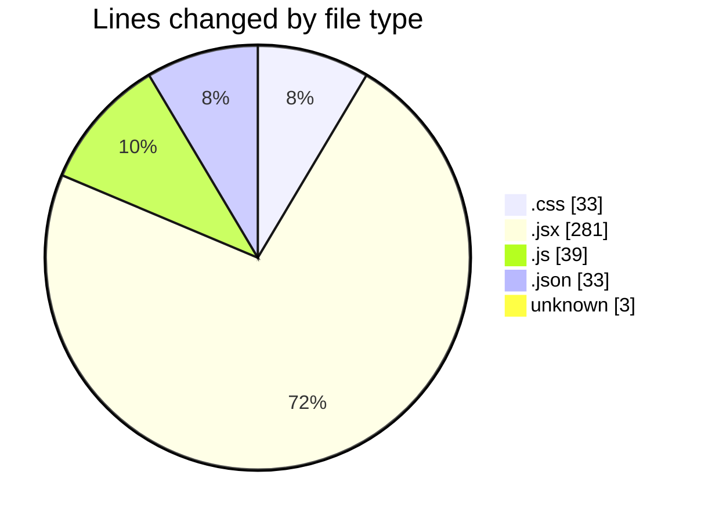
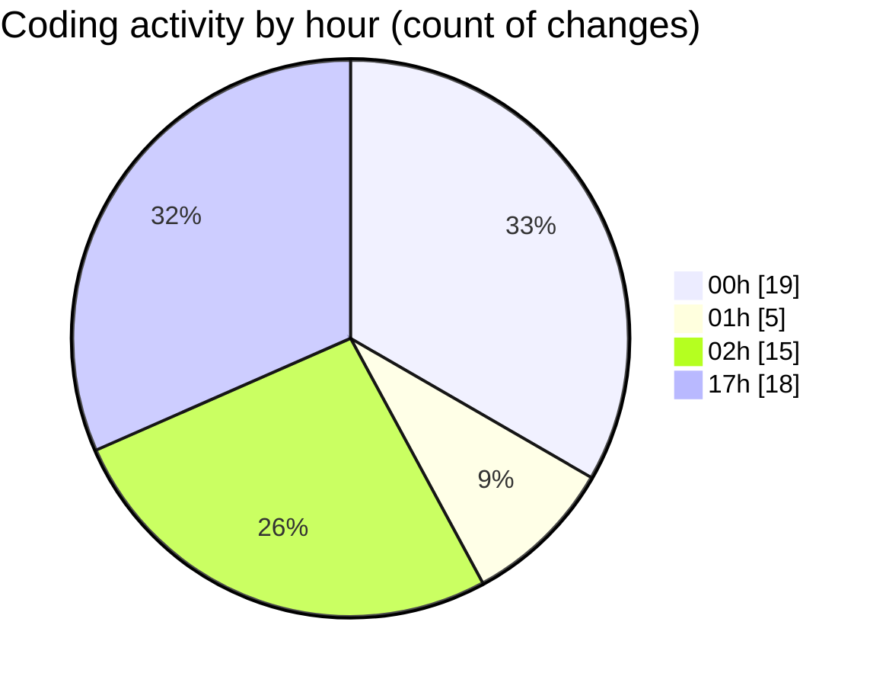

# EliteGPT - Activity Summary 

## Overall Statistics

| Stat                   | Value                                                             |
| ---------------------- | ----------------------------------------------------------------- |
| **Lines Added** (➕)   | 351                                          |
| **Lines Removed** (➖) | 38                                        |
| **Net Change** (↕)    | 313                |
| **Active Time** (⌚)   | 85 minutes |

## Modified Files
- **index.css** (+17, -16)
- **History.jsx** (+1, -2)
- **Main.jsx** (+113, -13)
- **Sidebar.jsx** (+63, -1)
- **App.jsx** (+16, -0)
- **Gemini.jsx** (+35, -0)
- **Gemini.js** (+37, -2)
- **package.json** (+33, -0)
- **c** (+3, -0)
- **Context.jsx** (+21, -4)
- **main.jsx** (+12, -0)

## Visualizations

### By File Type (Lines Changed)

### By Hour (Estimated Activity Count)

> **Last Updated:** 2/14/2025, 5:42:48 PM