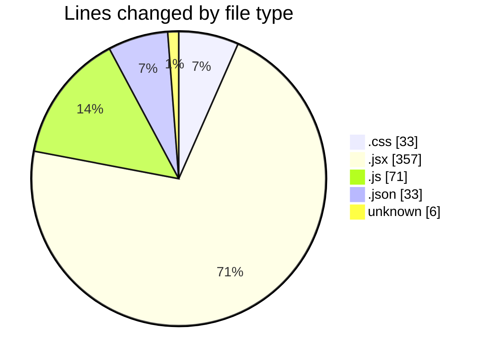
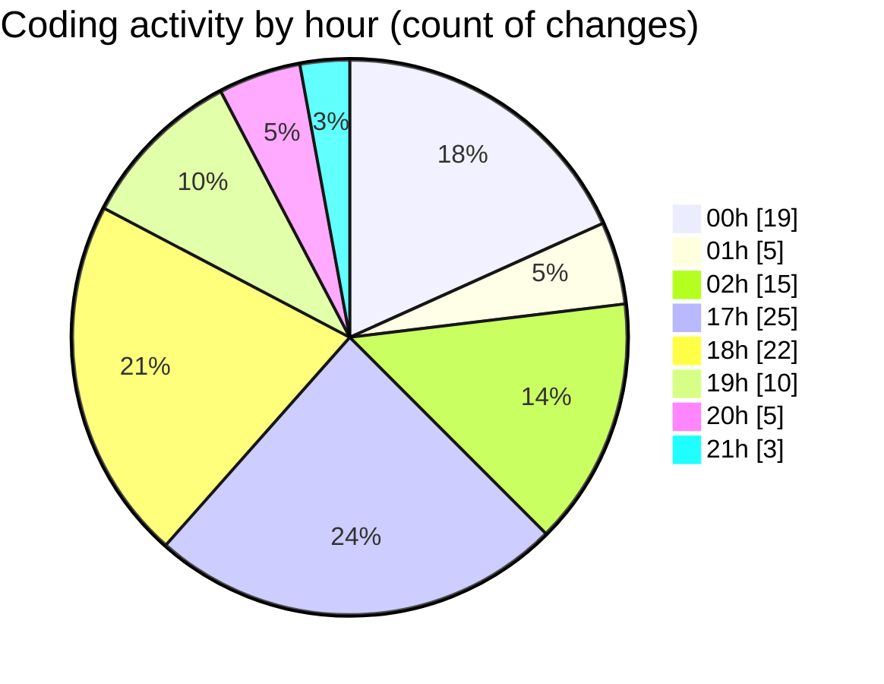

# EliteGPT - Activity Summary 

## Overall Statistics

| Stat                   | Value                                                             |
| ---------------------- | ----------------------------------------------------------------- |
| **Lines Added** (➕)   | 436                                          |
| **Lines Removed** (➖) | 64                                        |
| **Net Change** (↕)    | 372                |
| **Active Time** (⌚)   | 176 minutes |

## Modified Files
- **index.css** (+17, -16)
- **History.jsx** (+1, -2)
- **Main.jsx** (+150, -18)
- **Sidebar.jsx** (+63, -1)
- **App.jsx** (+16, -0)
- **Gemini.jsx** (+35, -0)
- **Gemini.js** (+53, -18)
- **package.json** (+33, -0)
- **c** (+3, -0)
- **Context.jsx** (+50, -9)
- **main.jsx** (+12, -0)
- **.env** (+1, -0)
- **.env** (+2, -0)

## Visualizations

### By File Type (Lines Changed)

### By Hour (Estimated Activity Count)

> **Last Updated:** 2/14/2025, 9:42:49 PM