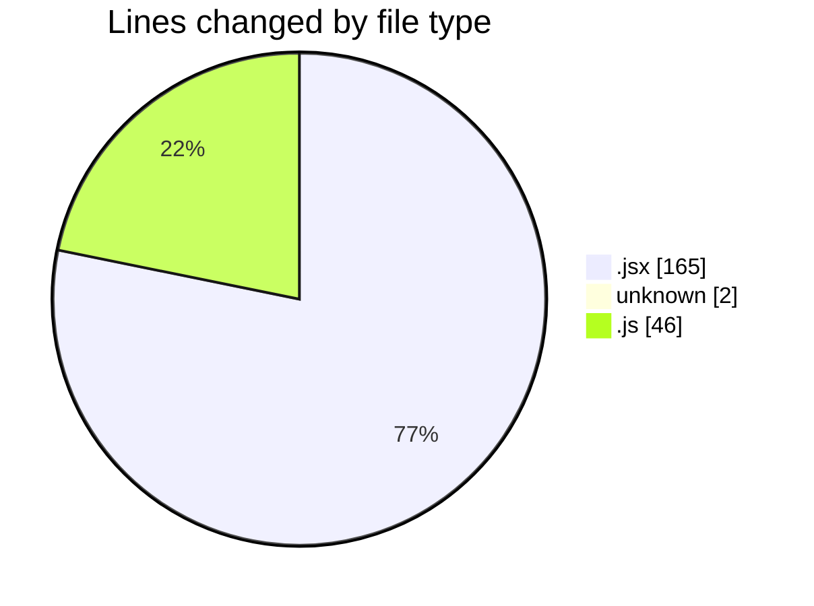
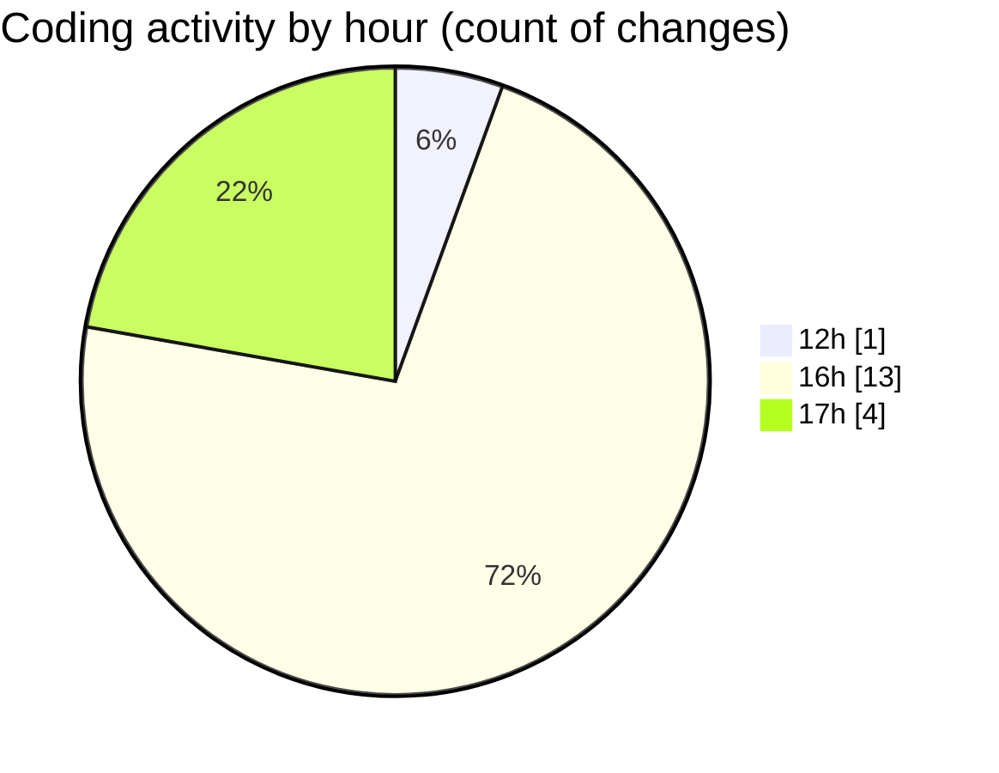

# EliteGPT - Activity Summary 

## Overall Statistics

| Stat                   | Value                                                             |
| ---------------------- | ----------------------------------------------------------------- |
| **Lines Added** (➕)   | 205                                          |
| **Lines Removed** (➖) | 8                                        |
| **Net Change** (↕)    | 197                |
| **Active Time** (⌚)   | 22 minutes |

## Modified Files
- **Context.jsx** (+14, -8)
- **Context_temp.jsx** (+86, -0)
- **Context_Updated.jsx** (+51, -0)
- **Sidebar.jsx** (+5, -0)
- **History.jsx** (+1, -0)
- **.env** (+2, -0)
- **vite.config.js** (+11, -0)
- **Gemini.js** (+35, -0)

## Visualizations

### By File Type (Lines Changed)

### By Hour (Estimated Activity Count)

> **Last Updated:** 2/22/2025, 5:45:01 PM