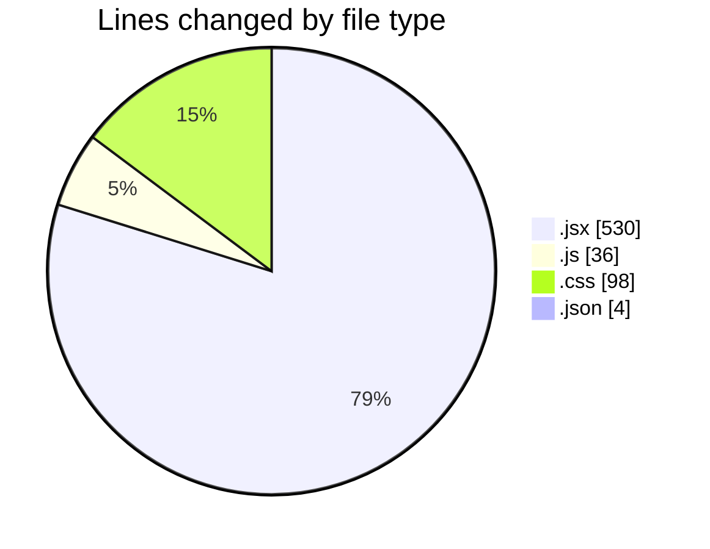
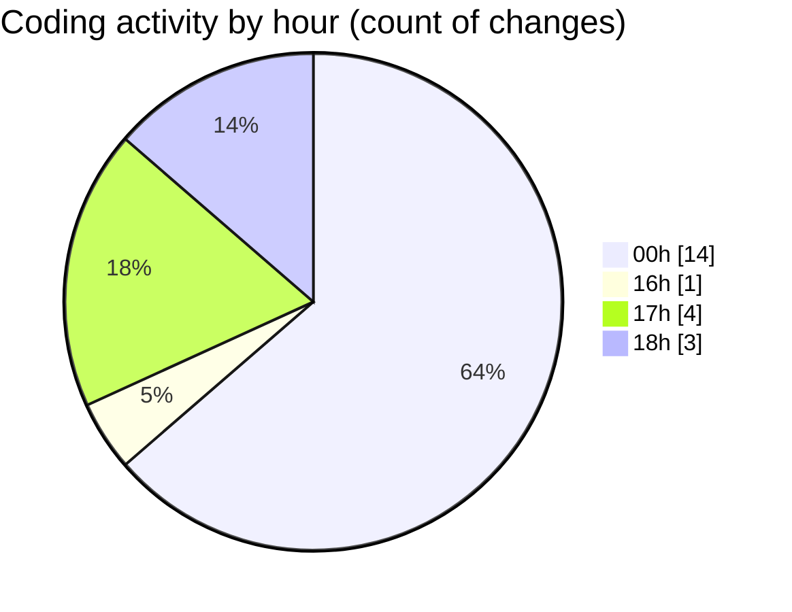

# ElitesGPT - Activity Summary 

## Overall Statistics

| Stat                   | Value                                                             |
| ---------------------- | ----------------------------------------------------------------- |
| **Lines Added** (➕)   | 641                                          |
| **Lines Removed** (➖) | 27                                        |
| **Net Change** (↕)    | 614                |
| **Active Time** (⌚)   | 32 minutes |

## Modified Files
- **Sidebar.jsx** (+51, -20)
- **App.jsx** (+17, -0)
- **Gemini.js** (+35, -1)
- **History.jsx** (+40, -3)
- **Main.jsx** (+314, -1)
- **index.css** (+98, -0)
- **settings.json** (+4, -0)
- **Context.jsx** (+82, -2)

## Visualizations

### By File Type (Lines Changed)

### By Hour (Estimated Activity Count)

> **Last Updated:** 3/9/2025, 6:19:45 PM