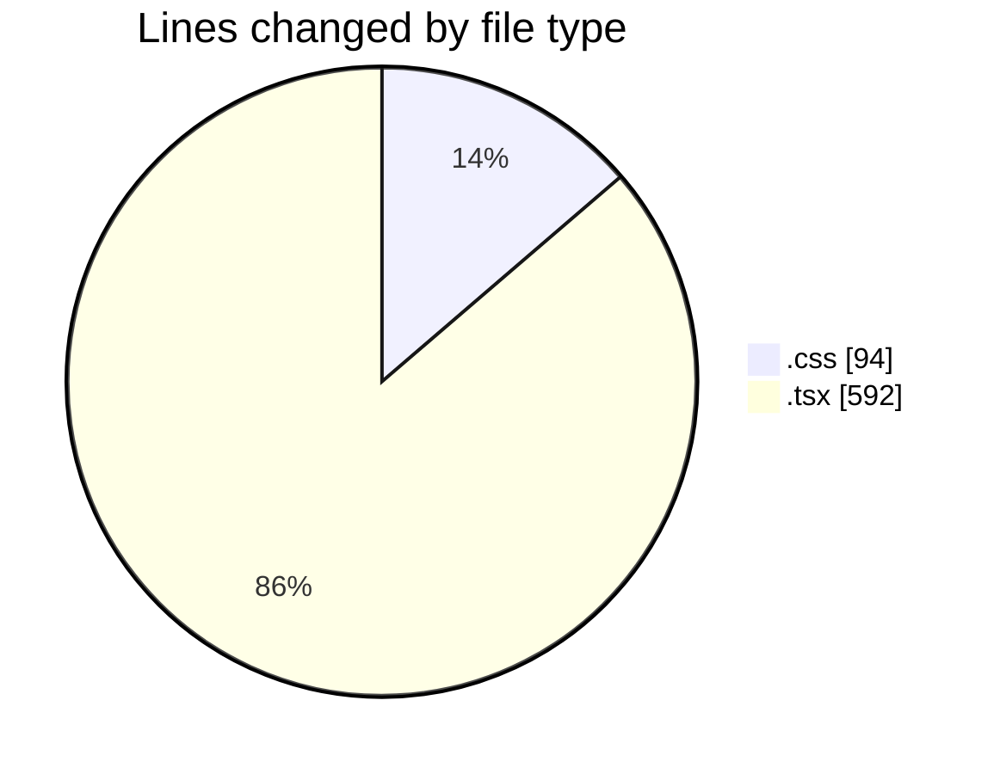
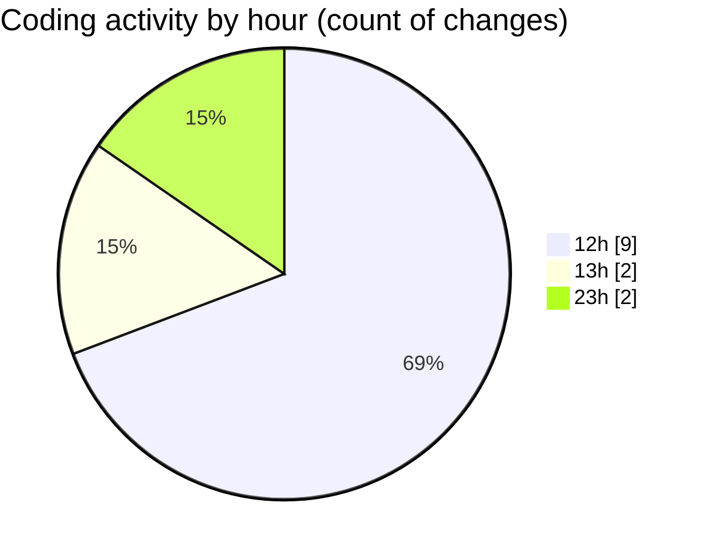

# BinarySec - Activity Summary 

## Overall Statistics

| Stat                   | Value                                                             |
| ---------------------- | ----------------------------------------------------------------- |
| **Lines Added** (➕)   | 656                                          |
| **Lines Removed** (➖) | 30                                        |
| **Net Change** (↕)    | 626                |
| **Active Time** (⌚)   | 11 minutes |

## Modified Files
- **App.css** (+93, -1)
- **Footer.tsx** (+122, -0)
- **ContactSection.tsx** (+64, -0)
- **ServicesSection.tsx** (+86, -0)
- **StudentReviewsSection.tsx** (+189, -29)
- **HeroSection.tsx** (+71, -0)
- **App.tsx** (+31, -0)

## Visualizations

### By File Type (Lines Changed)

### By Hour (Estimated Activity Count)

> **Last Updated:** 3/29/2025, 1:00:39 PM