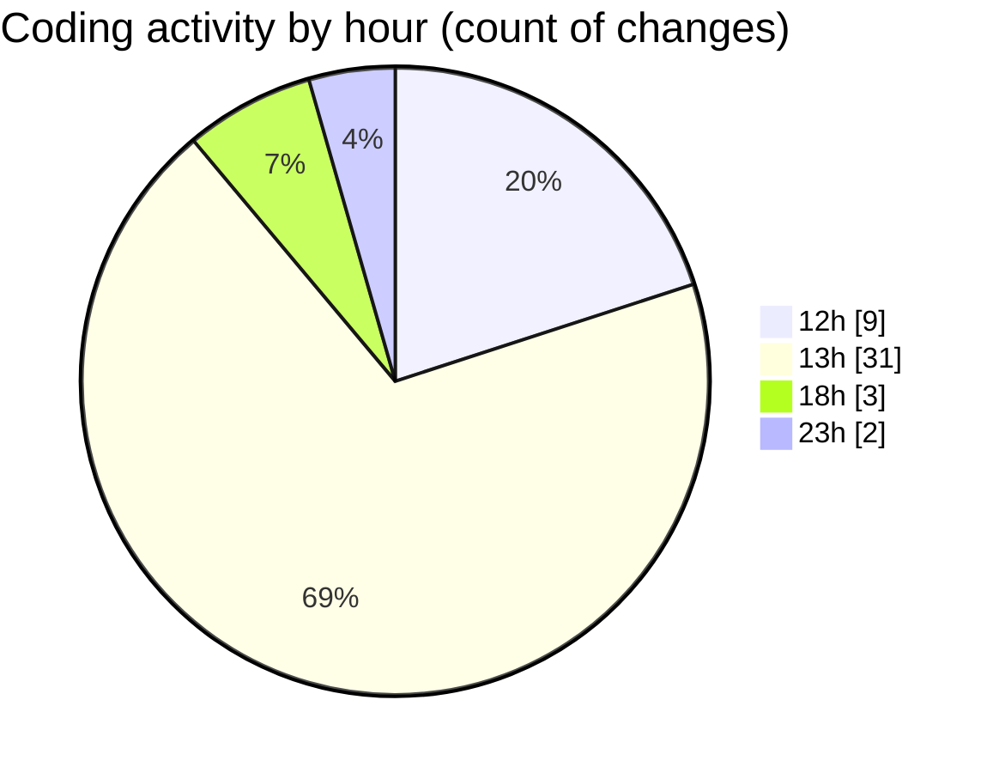

# BinarySec - Activity Summary 

## Overall Statistics

| Stat                   | Value                                                             |
| ---------------------- | ----------------------------------------------------------------- |
| **Lines Added** (➕)   | 2051                                          |
| **Lines Removed** (➖) | 119                                        |
| **Net Change** (↕)    | 1932                |
| **Active Time** (⌚)   | 55 minutes |

## Modified Files
- **App.css** (+95, -3)
- **Footer.tsx** (+122, -0)
- **ContactSection.tsx** (+64, -0)
- **ServicesSection.tsx** (+121, -16)
- **StudentReviewsSection.tsx** (+227, -45)
- **HeroSection.tsx** (+97, -23)
- **App.tsx** (+31, -2)
- **index.css** (+72, -10)
- **Index.tsx** (+24, -1)
- **responsive.css** (+41, -0)
- **index.html** (+12, -0)
- **sidebar.tsx** (+781, -19)
- **chart.tsx** (+364, -0)

## Visualizations

### By File Type (Lines Changed)

### By Hour (Estimated Activity Count)

> **Last Updated:** 3/29/2025, 6:36:35 PM