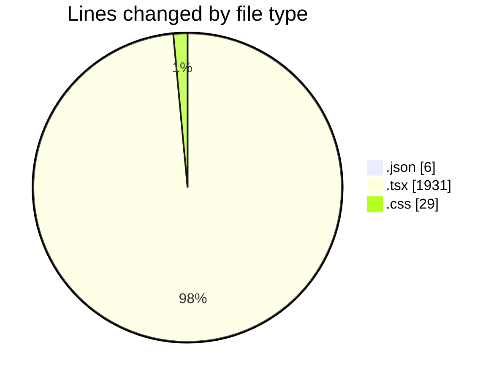
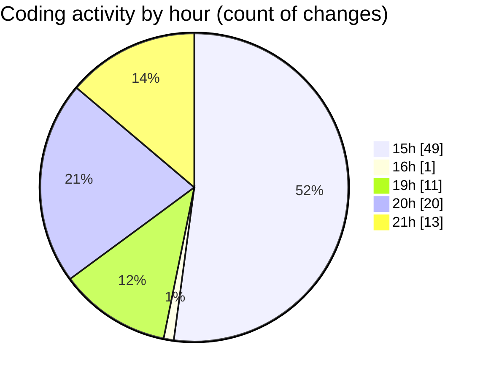

# sungpt - Activity Summary 

## Overall Statistics

| Stat                   | Value                                                             |
| ---------------------- | ----------------------------------------------------------------- |
| **Lines Added** (➕)   | 1455                                          |
| **Lines Removed** (➖) | 511                                        |
| **Net Change** (↕)    | 944                |
| **Active Time** (⌚)   | 141 minutes |

## Modified Files
- **package.json** (+4, -2)
- **page.tsx** (+332, -291)
- **ChatUI.tsx** (+255, -20)
- **Sidebar.tsx** (+243, -97)
- **layout.tsx** (+70, -0)
- **globals.css** (+18, -11)
- **ChatInterface.tsx** (+142, -26)
- **App.tsx** (+352, -61)
- **Main.tsx** (+39, -3)

## Visualizations

### By File Type (Lines Changed)

### By Hour (Estimated Activity Count)

> **Last Updated:** 4/7/2025, 9:46:37 PM