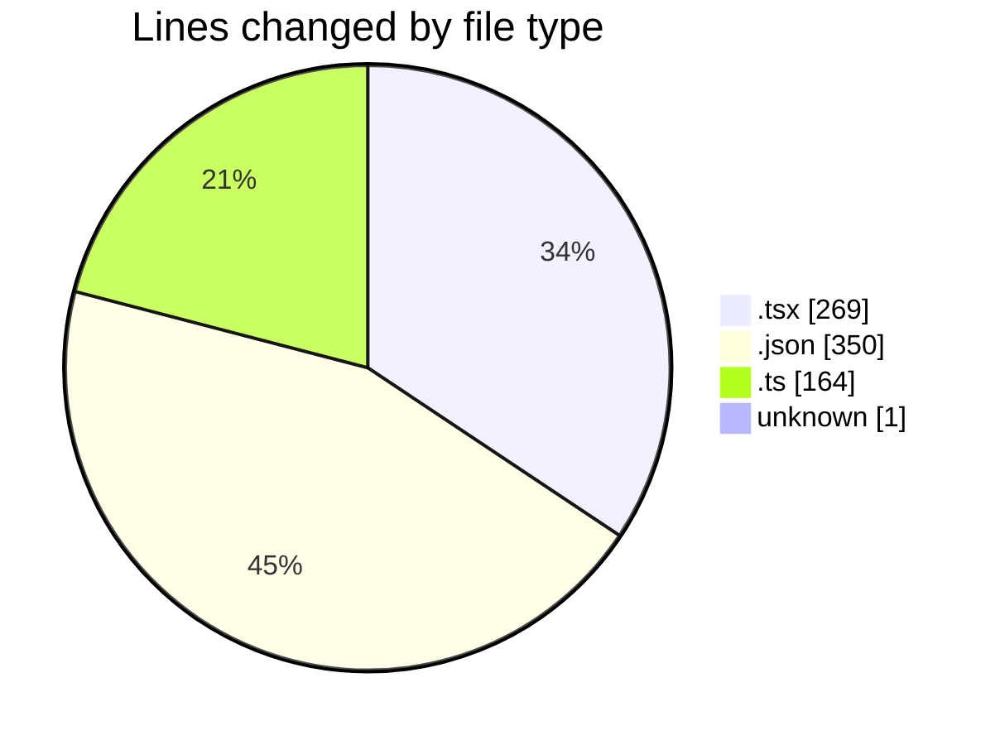
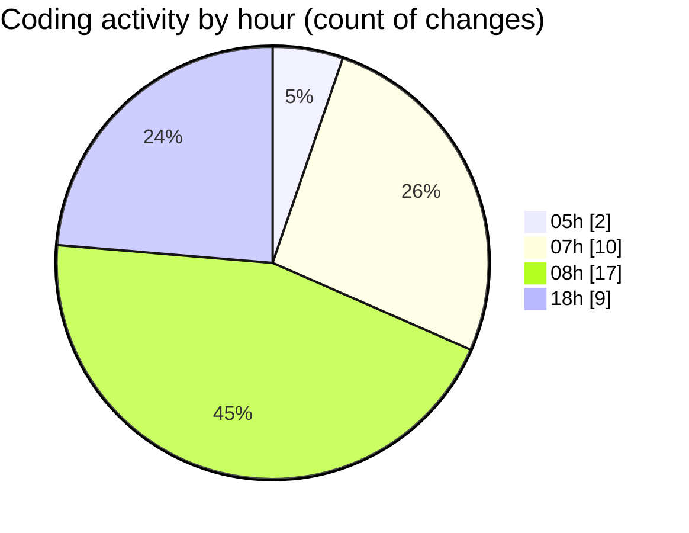

# sungpt - Activity Summary 

## Overall Statistics

| Stat                   | Value                                                             |
| ---------------------- | ----------------------------------------------------------------- |
| **Lines Added** (➕)   | 704                                          |
| **Lines Removed** (➖) | 80                                        |
| **Net Change** (↕)    | 624                |
| **Active Time** (⌚)   | 52 minutes |

## Modified Files
- **ChatUI.tsx** (+141, -57)
- **package.json** (+64, -0)
- **route.tsx** (+71, -0)
- **keybindings.json** (+83, -4)
- **settings.json** (+199, -0)
- **next-env.d.ts** (+7, -0)
- **useChat.ts** (+83, -19)
- **route.ts** (+55, -0)
- **.env** (+1, -0)

## Visualizations

### By File Type (Lines Changed)

### By Hour (Estimated Activity Count)

> **Last Updated:** 4/8/2025, 6:52:09 PM