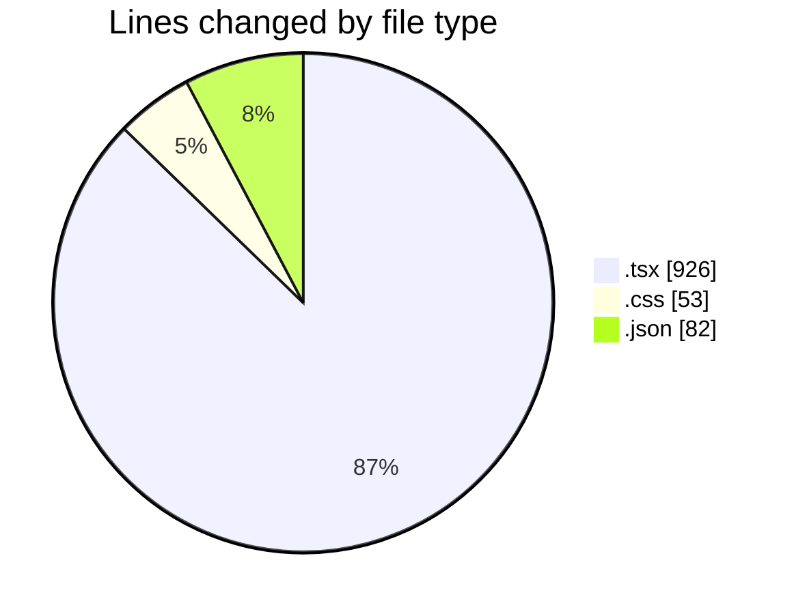
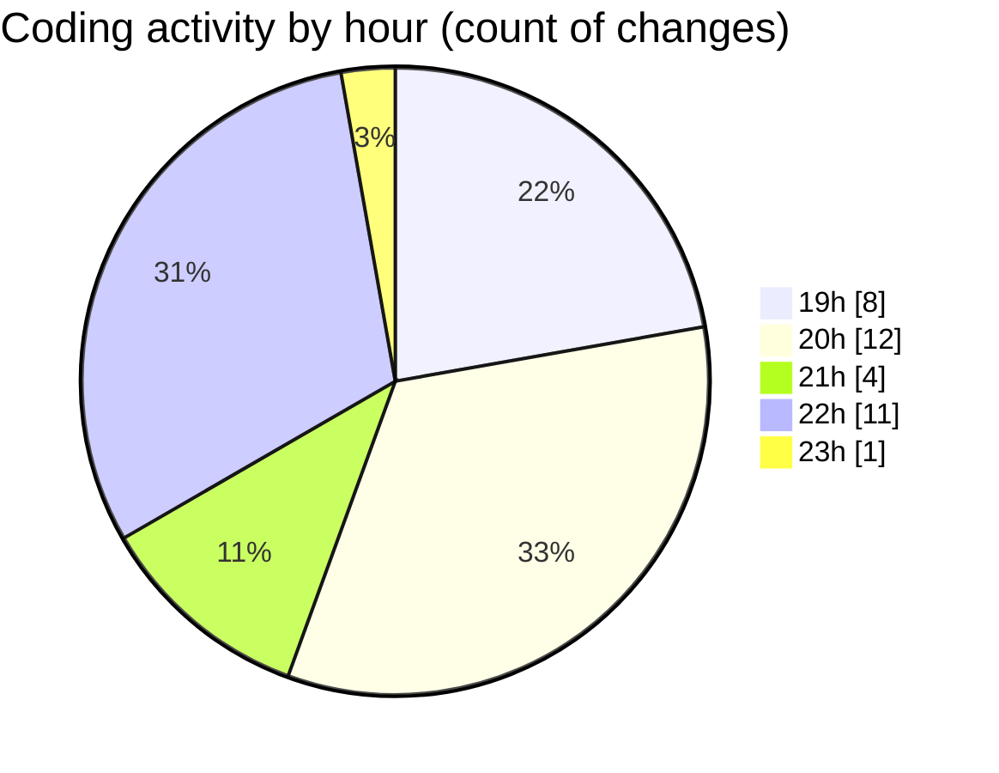

# product-page - Activity Summary 

## Overall Statistics

| Stat                   | Value                                                             |
| ---------------------- | ----------------------------------------------------------------- |
| **Lines Added** (➕)   | 1040                                          |
| **Lines Removed** (➖) | 21                                        |
| **Net Change** (↕)    | 1019                |
| **Active Time** (⌚)   | 53 minutes |

## Modified Files
- **Prestataire_detail.tsx** (+168, -7)
- **globals.css** (+53, -0)
- **page.tsx** (+48, -0)
- **Commande_detail.tsx** (+142, -1)
- **cmd.json** (+64, -0)
- **Produit_detail.tsx** (+88, -0)
- **Boutique_detail.tsx** (+198, -11)
- **layout.tsx** (+28, -0)
- **layout.tsx** (+52, -1)
- **Laala_detail.tsx** (+120, -1)
- **page.tsx** (+10, -0)
- **Retrait_detail.tsx** (+42, -0)
- **page.tsx** (+9, -0)
- **retrait.json** (+18, -0)

## Visualizations

### By File Type (Lines Changed)

### By Hour (Estimated Activity Count)

> **Last Updated:** 4/10/2025, 11:04:05 PM