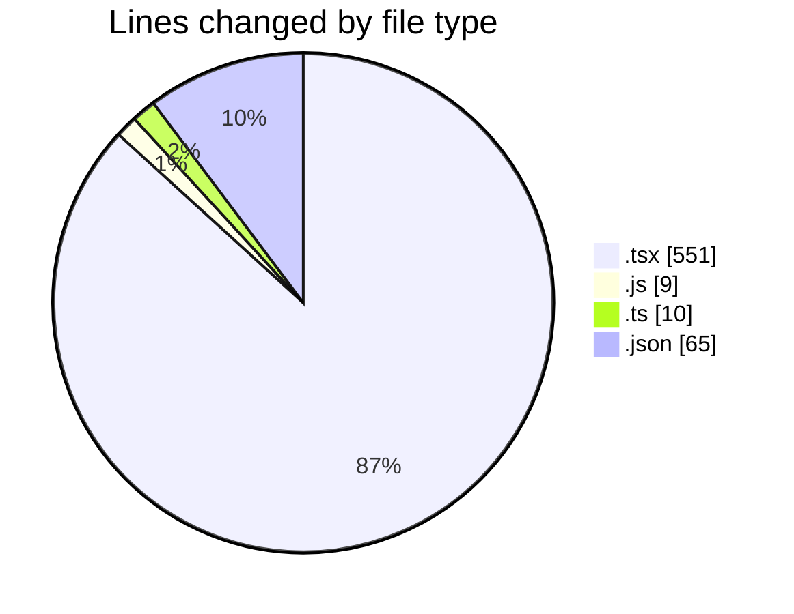
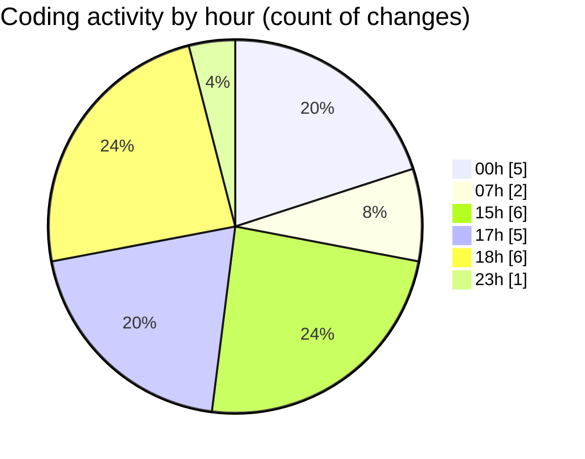

# product-page - Activity Summary 

## Overall Statistics

| Stat                   | Value                                                             |
| ---------------------- | ----------------------------------------------------------------- |
| **Lines Added** (➕)   | 585                                          |
| **Lines Removed** (➖) | 50                                        |
| **Net Change** (↕)    | 535                |
| **Active Time** (⌚)   | 40 minutes |

## Modified Files
- **Commande_detail.tsx** (+167, -2)
- **next.config.js** (+9, -0)
- **next.config.ts** (+10, -0)
- **package.json** (+1, -0)
- **Retrait_detail.tsx** (+97, -21)
- **Laala_detail.tsx** (+119, -17)
- **layout.tsx** (+28, -10)
- **Produit_detail.tsx** (+90, -0)
- **commande.json** (+64, -0)

## Visualizations

### By File Type (Lines Changed)

### By Hour (Estimated Activity Count)

> **Last Updated:** 4/11/2025, 6:24:40 PM