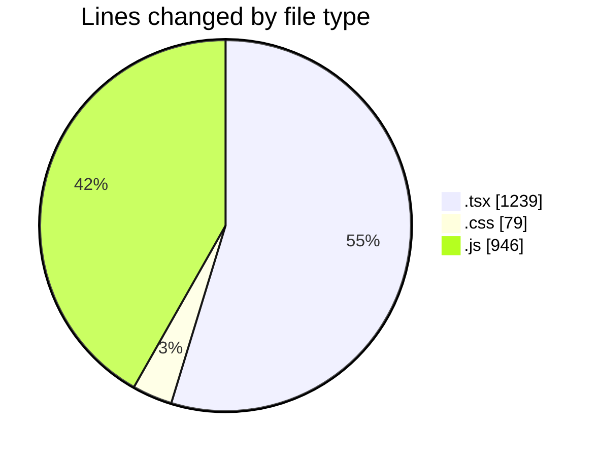
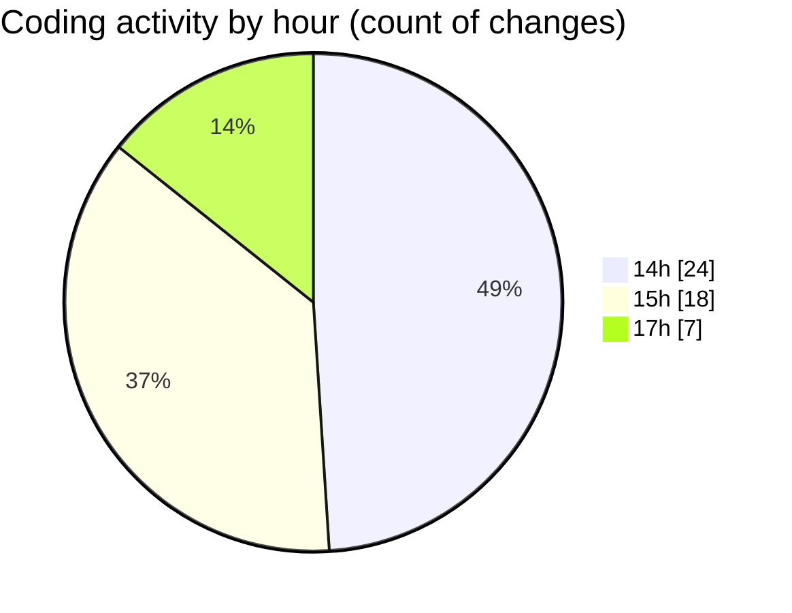

# indesign - Activity Summary 

## Overall Statistics

| Stat                   | Value                                                             |
| ---------------------- | ----------------------------------------------------------------- |
| **Lines Added** (➕)   | 2056                                          |
| **Lines Removed** (➖) | 208                                        |
| **Net Change** (↕)    | 1848                |
| **Active Time** (⌚)   | 61 minutes |

## Modified Files
- **Brand.tsx** (+56, -13)
- **Nav.tsx** (+289, -32)
- **Hero.tsx** (+183, -0)
- **Features.tsx** (+223, -42)
- **page.tsx** (+32, -0)
- **globals.css** (+39, -12)
- **Components_dd38fe43._.js** (+265, -0)
- **[root-of-the-server]__ba9c4a92._.js** (+259, -0)
- **_cc52e176._.js** (+422, -0)
- **Footer.tsx** (+199, -108)
- **layout.tsx** (+37, -1)
- **shiny.css** (+28, -0)
- **ShinyText.tsx** (+24, -0)

## Visualizations

### By File Type (Lines Changed)

### By Hour (Estimated Activity Count)

> **Last Updated:** 4/22/2025, 5:24:07 PM