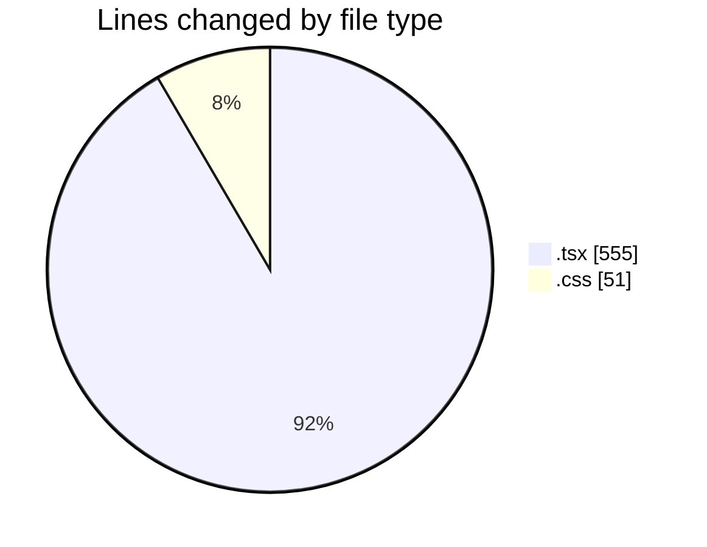
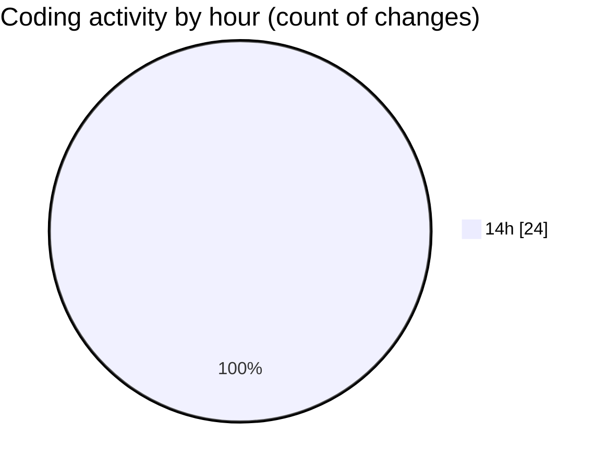

# indesign - Activity Summary 

## Overall Statistics

| Stat                   | Value                                                             |
| ---------------------- | ----------------------------------------------------------------- |
| **Lines Added** (➕)   | 554                                          |
| **Lines Removed** (➖) | 52                                        |
| **Net Change** (↕)    | 502                |
| **Active Time** (⌚)   | 32 minutes |

## Modified Files
- **Brand.tsx** (+28, -0)
- **Nav.tsx** (+202, -30)
- **Hero.tsx** (+122, -0)
- **Features.tsx** (+148, -10)
- **page.tsx** (+15, -0)
- **globals.css** (+39, -12)

## Visualizations

### By File Type (Lines Changed)

### By Hour (Estimated Activity Count)

> **Last Updated:** 4/22/2025, 2:53:51 PM