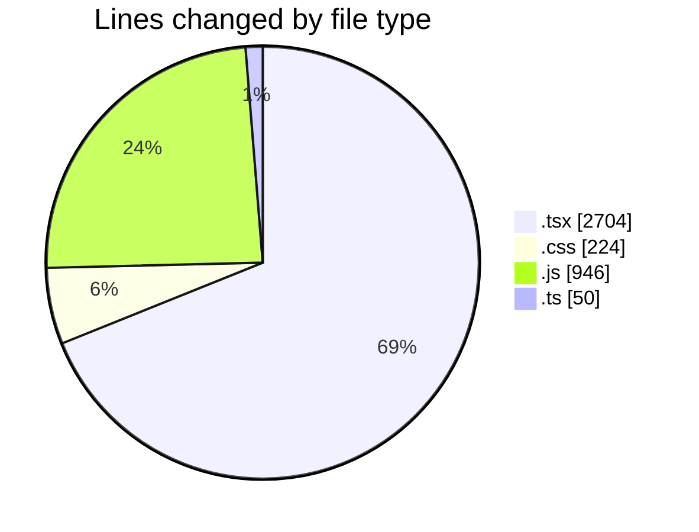
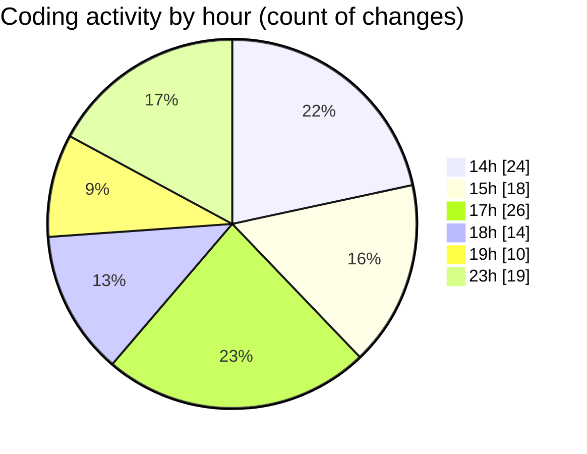

# indesign - Activity Summary 

## Overall Statistics

| Stat                   | Value                                                             |
| ---------------------- | ----------------------------------------------------------------- |
| **Lines Added** (➕)   | 3395                                          |
| **Lines Removed** (➖) | 529                                        |
| **Net Change** (↕)    | 2866                |
| **Active Time** (⌚)   | 151 minutes |

## Modified Files
- **Brand.tsx** (+56, -14)
- **Nav.tsx** (+400, -77)
- **Hero.tsx** (+295, -1)
- **Features.tsx** (+269, -43)
- **page.tsx** (+94, -2)
- **globals.css** (+39, -12)
- **Components_dd38fe43._.js** (+265, -0)
- **[root-of-the-server]__ba9c4a92._.js** (+259, -0)
- **_cc52e176._.js** (+422, -0)
- **Footer.tsx** (+384, -108)
- **layout.tsx** (+84, -14)
- **shiny.css** (+30, -0)
- **ShinyText.tsx** (+46, -22)
- **truefocus.css** (+72, -71)
- **TrueFocus.tsx** (+315, -159)
- **MetalBalls.tsx** (+321, -0)
- **aos.ts** (+13, -0)
- **next.config.ts** (+31, -6)

## Visualizations

### By File Type (Lines Changed)

### By Hour (Estimated Activity Count)

> **Last Updated:** 4/22/2025, 11:46:34 PM