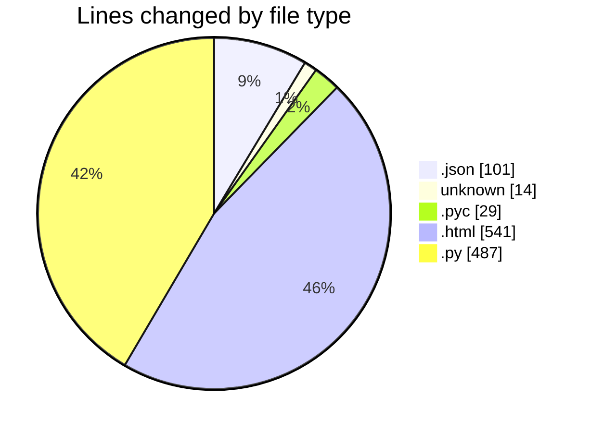
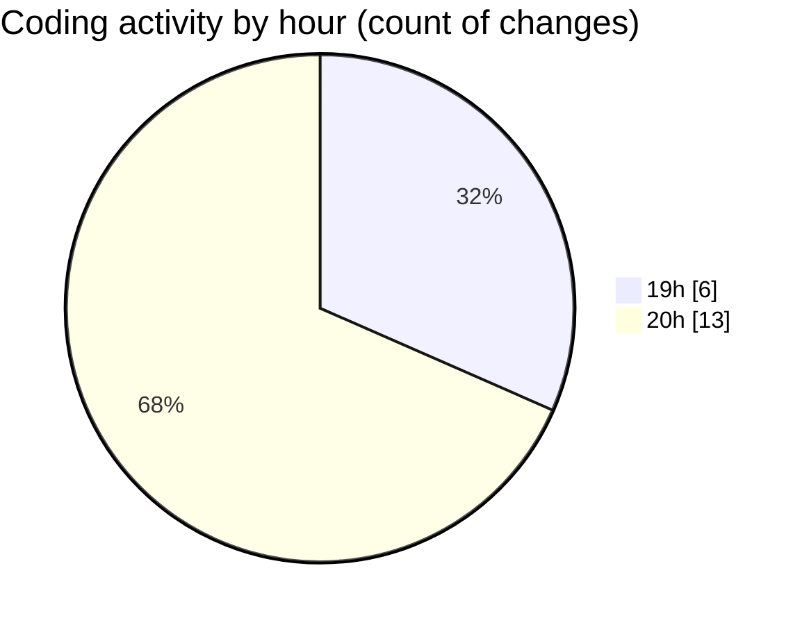

# heypy - Activity Summary 

## Overall Statistics

| Stat                   | Value                                                             |
| ---------------------- | ----------------------------------------------------------------- |
| **Lines Added** (➕)   | 1112                                          |
| **Lines Removed** (➖) | 60                                        |
| **Net Change** (↕)    | 1052                |
| **Active Time** (⌚)   | 28 minutes |

## Modified Files
- **settings.json** (+101, -0)
- **.gitignore** (+12, -2)
- **settings.cpython-313.pyc** (+29, -0)
- **paiement.html** (+327, -1)
- **payement.html** (+213, -0)
- **views.py** (+430, -57)

## Visualizations

### By File Type (Lines Changed)

### By Hour (Estimated Activity Count)

> **Last Updated:** 4/23/2025, 8:43:05 PM