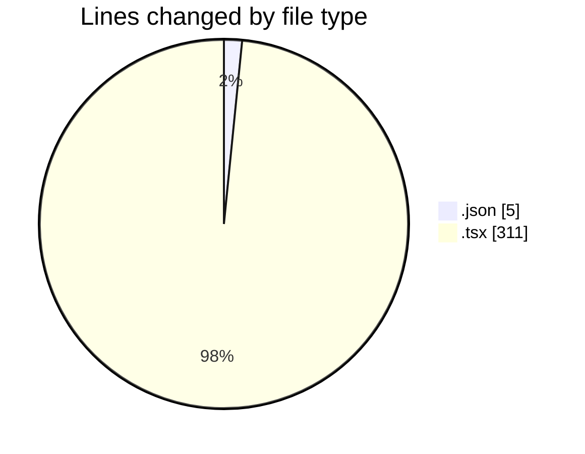
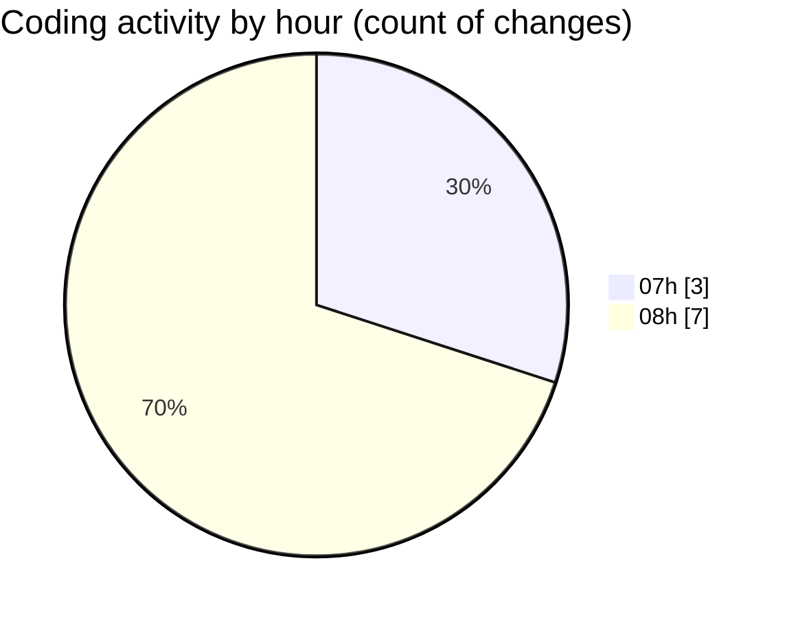

# indesign - Activity Summary 

## Overall Statistics

| Stat                   | Value                                                             |
| ---------------------- | ----------------------------------------------------------------- |
| **Lines Added** (➕)   | 294                                          |
| **Lines Removed** (➖) | 22                                        |
| **Net Change** (↕)    | 272                |
| **Active Time** (⌚)   | 15 minutes |

## Modified Files
- **package.json** (+3, -2)
- **layout.tsx** (+36, -0)
- **Hero.tsx** (+87, -0)
- **Nav.tsx** (+75, -20)
- **Footer.tsx** (+93, -0)

## Visualizations

### By File Type (Lines Changed)

### By Hour (Estimated Activity Count)

> **Last Updated:** 4/23/2025, 8:13:41 AM