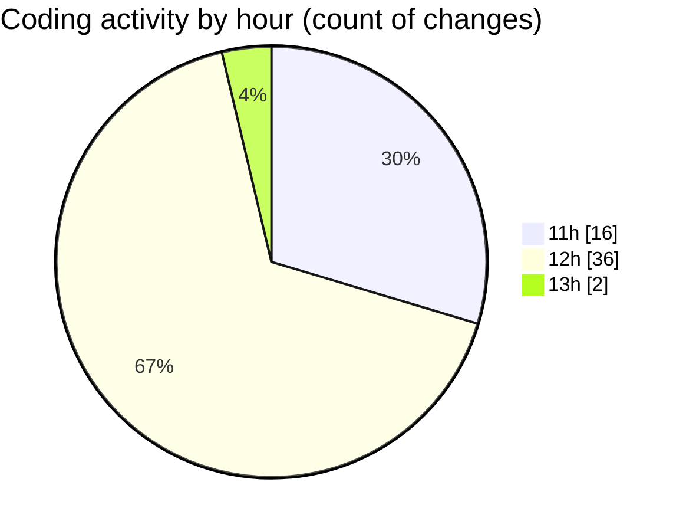

# product-page - Activity Summary 

## Overall Statistics

| Stat                   | Value                                                             |
| ---------------------- | ----------------------------------------------------------------- |
| **Lines Added** (➕)   | 1567                                          |
| **Lines Removed** (➖) | 547                                        |
| **Net Change** (↕)    | 1020                |
| **Active Time** (⌚)   | 80 minutes |

## Modified Files
- **package.json** (+3, -2)
- **Produit_detail.tsx** (+140, -37)
- **page.tsx** (+7, -0)
- **Laala_detail.tsx** (+262, -111)
- **page.tsx** (+7, -0)
- **Prestataire_detail.tsx** (+323, -127)
- **page.tsx** (+7, -0)
- **Boutique_detail.tsx** (+278, -87)
- **page.tsx** (+7, -0)
- **Commande_detail.tsx** (+164, -0)
- **page.tsx** (+8, -0)
- **Retrait_detail.tsx** (+190, -110)
- **page.tsx** (+12, -4)
- **layout.tsx** (+65, -28)
- **globals.css** (+94, -41)

## Visualizations

### By File Type (Lines Changed)

### By Hour (Estimated Activity Count)

> **Last Updated:** 4/26/2025, 1:05:52 PM