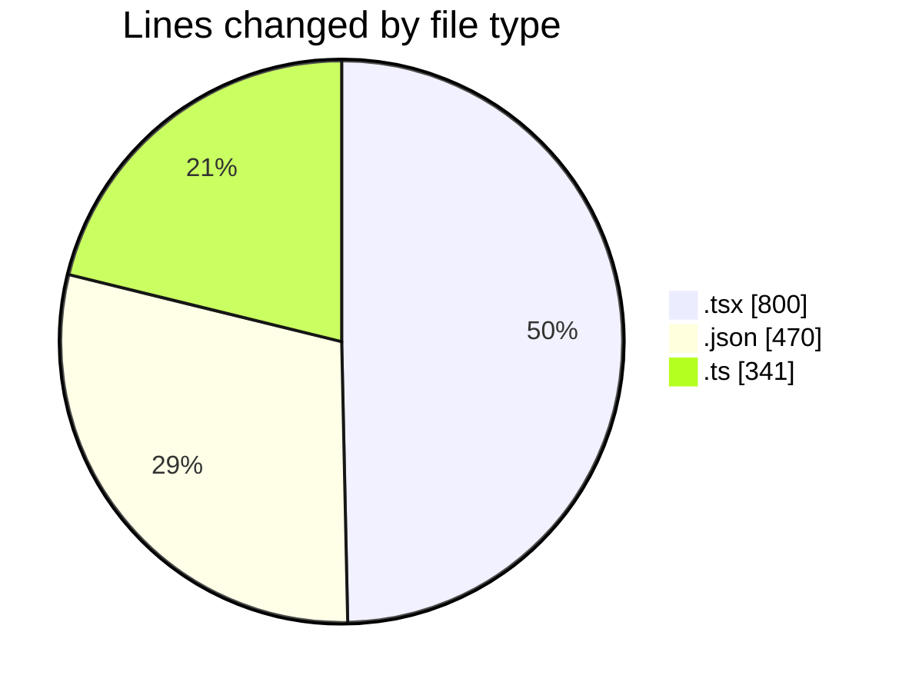
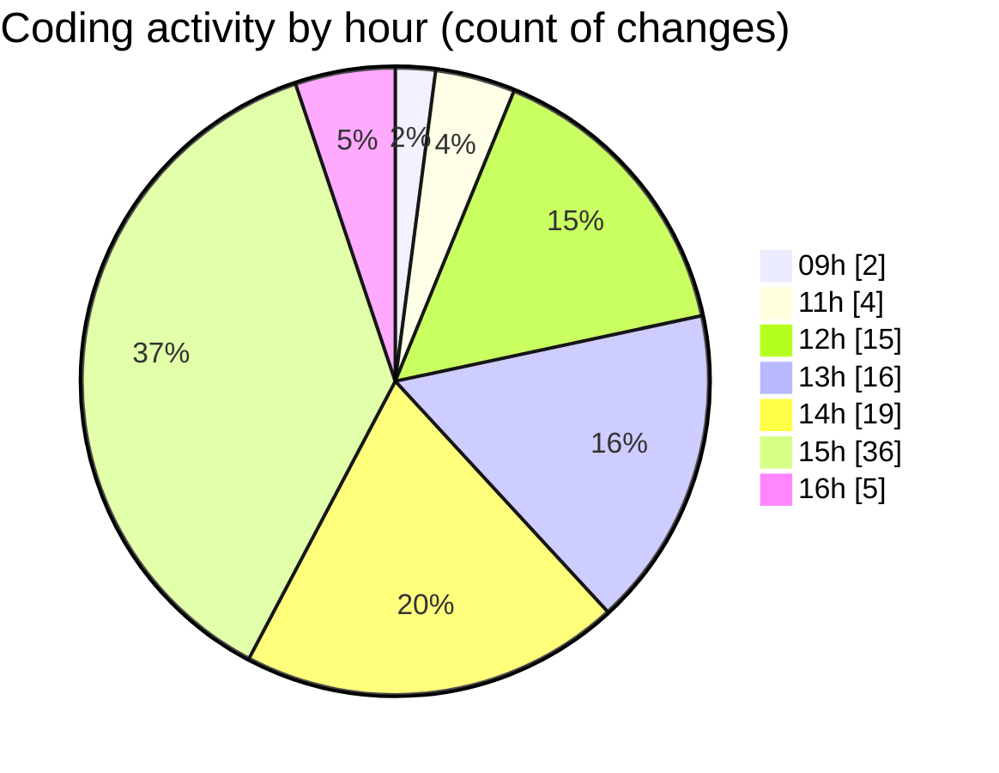

# niten - Activity Summary 

## Overall Statistics

| Stat                   | Value                                                             |
| ---------------------- | ----------------------------------------------------------------- |
| **Lines Added** (➕)   | 1448                                          |
| **Lines Removed** (➖) | 163                                        |
| **Net Change** (↕)    | 1285                |
| **Active Time** (⌚)   | 133 minutes |

## Modified Files
- **page.tsx** (+263, -1)
- **settings.json** (+205, -0)
- **next.config.ts** (+26, -0)
- **routing.ts** (+9, -0)
- **navigation.ts** (+7, -0)
- **middleware.ts** (+11, -10)
- **request.ts** (+16, -0)
- **layout.tsx** (+149, -11)
- **config.ts** (+6, -1)
- **LanguageSwitcher.tsx** (+49, -0)
- **i18n.ts** (+51, -17)
- **routing.ts** (+12, -0)
- **middleware.ts** (+51, -1)
- **layout.tsx** (+86, -20)
- **page.tsx** (+23, -0)
- **page.tsx** (+68, -0)
- **page.tsx** (+16, -0)
- **Hero.tsx** (+60, -0)
- **home.json** (+20, -0)
- **about.json** (+51, -32)
- **config.ts** (+64, -16)
- **navigation.ts** (+40, -3)
- **common.json** (+24, -0)
- **common.json** (+48, -0)
- **layout.tsx** (+47, -7)
- **en.json** (+23, -22)
- **fr.json** (+23, -22)

## Visualizations

### By File Type (Lines Changed)

### By Hour (Estimated Activity Count)

> **Last Updated:** 4/30/2025, 4:05:20 PM