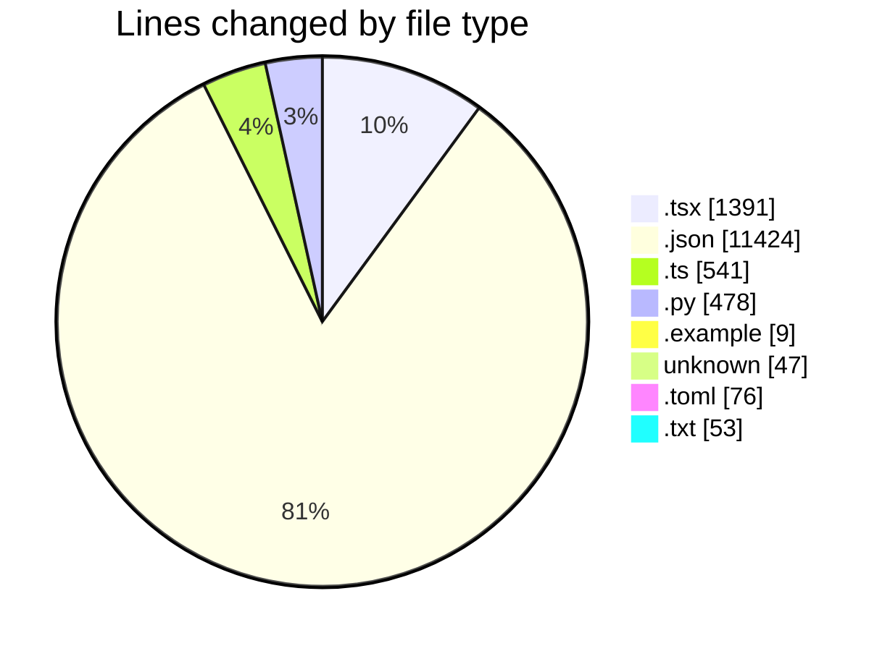
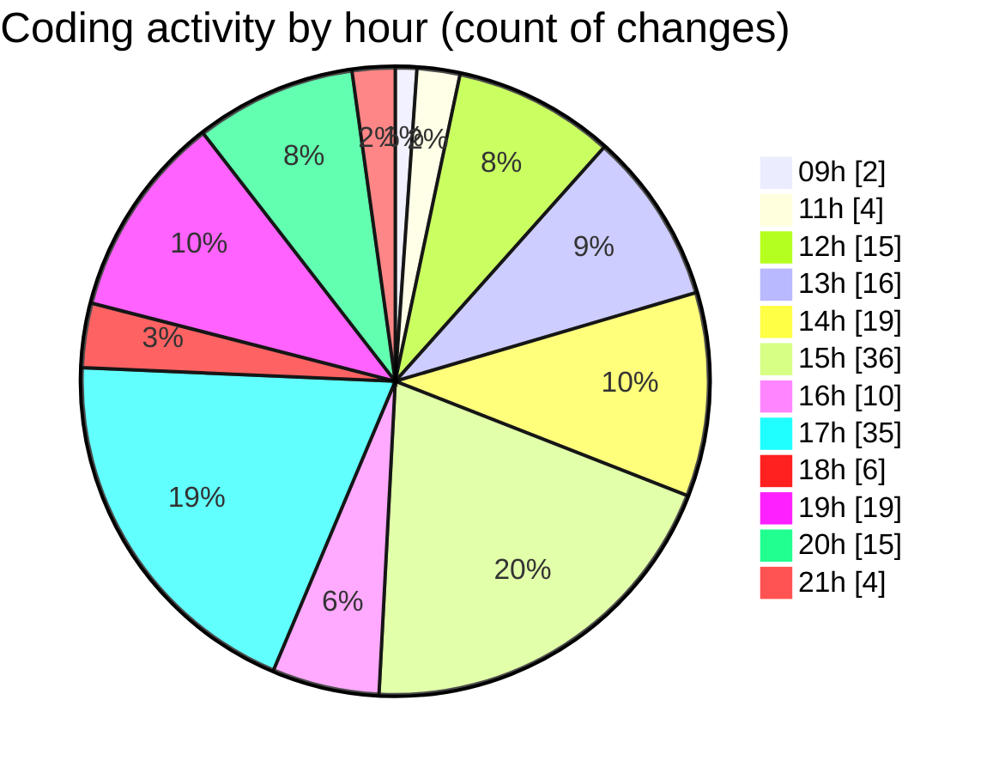

# niten - Activity Summary 

## Overall Statistics

| Stat                   | Value                                                             |
| ---------------------- | ----------------------------------------------------------------- |
| **Lines Added** (➕)   | 13625                                          |
| **Lines Removed** (➖) | 394                                        |
| **Net Change** (↕)    | 13231                |
| **Active Time** (⌚)   | 260 minutes |

## Modified Files
- **page.tsx** (+526, -1)
- **settings.json** (+205, -0)
- **next.config.ts** (+51, -0)
- **routing.ts** (+9, -0)
- **navigation.ts** (+7, -0)
- **middleware.ts** (+11, -10)
- **request.ts** (+16, -0)
- **layout.tsx** (+149, -11)
- **config.ts** (+6, -1)
- **LanguageSwitcher.tsx** (+49, -0)
- **i18n.ts** (+51, -17)
- **routing.ts** (+62, -12)
- **middleware.ts** (+89, -21)
- **layout.tsx** (+107, -20)
- **page.tsx** (+23, -0)
- **page.tsx** (+68, -0)
- **page.tsx** (+16, -0)
- **Hero.tsx** (+60, -0)
- **home.json** (+79, -0)
- **about.json** (+51, -32)
- **config.ts** (+64, -16)
- **navigation.ts** (+40, -3)
- **common.json** (+48, -0)
- **common.json** (+72, -0)
- **layout.tsx** (+47, -7)
- **en.json** (+23, -22)
- **fr.json** (+23, -22)
- **page.tsx** (+70, -0)
- **database.py** (+71, -42)
- **job_repository.py** (+46, -14)
- **careers.py** (+84, -19)
- **.env.example** (+5, -4)
- **.env** (+47, -0)
- **pyproject.toml** (+74, -2)
- **requirements.txt** (+53, -0)
- **__init__.py** (+2, -1)
- **main.py** (+37, -4)
- **config.py** (+106, -52)
- **request.ts** (+24, -0)
- **middleware.ts** (+9, -8)
- **package-lock.json** (+10788, -0)
- **page.tsx** (+23, -0)
- **page.tsx** (+68, -0)
- **layout.tsx** (+93, -53)
- **getMessages.ts** (+14, -0)
- **home.json** (+59, -0)

## Visualizations

### By File Type (Lines Changed)

### By Hour (Estimated Activity Count)

> **Last Updated:** 4/30/2025, 9:15:23 PM