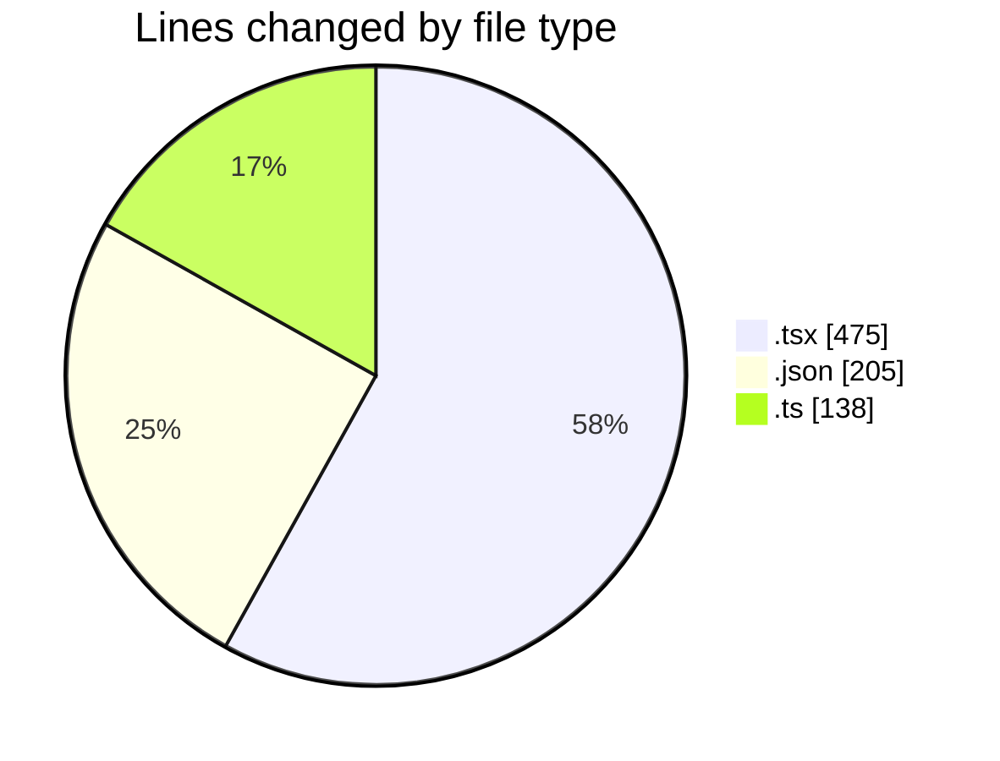
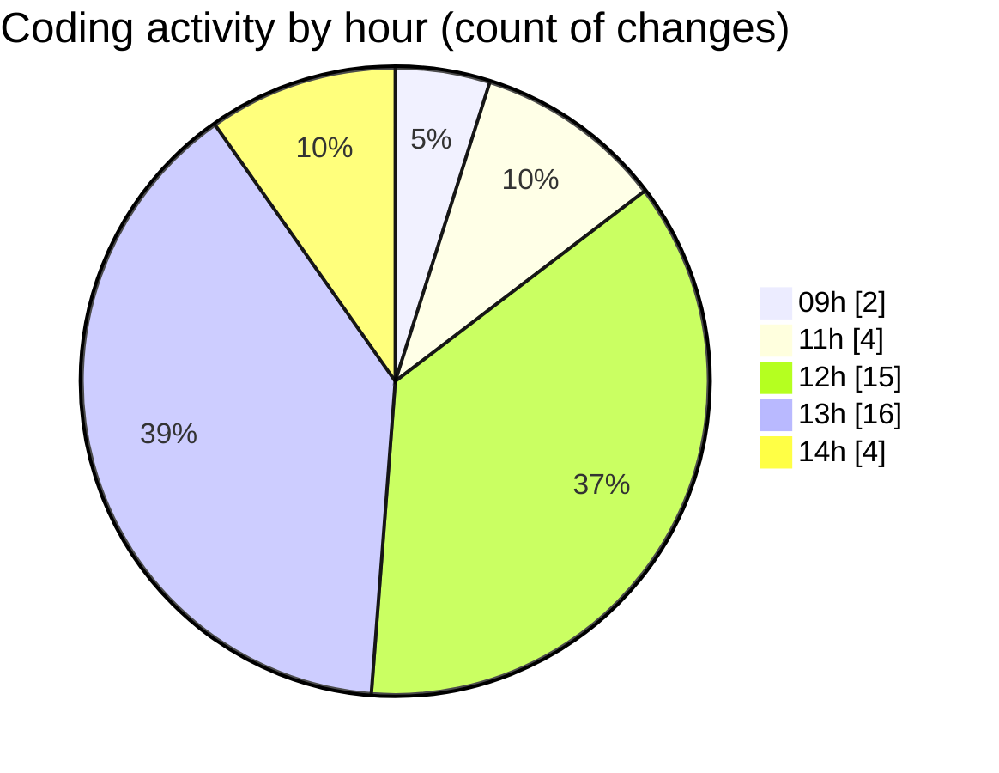

# niten - Activity Summary 

## Overall Statistics

| Stat                   | Value                                                             |
| ---------------------- | ----------------------------------------------------------------- |
| **Lines Added** (➕)   | 798                                          |
| **Lines Removed** (➖) | 20                                        |
| **Net Change** (↕)    | 778                |
| **Active Time** (⌚)   | 51 minutes |

## Modified Files
- **page.tsx** (+263, -1)
- **settings.json** (+205, -0)
- **next.config.ts** (+24, -0)
- **routing.ts** (+9, -0)
- **navigation.ts** (+7, -0)
- **middleware.ts** (+11, -10)
- **request.ts** (+16, -0)
- **layout.tsx** (+25, -0)
- **config.ts** (+6, -1)
- **LanguageSwitcher.tsx** (+49, -0)
- **i18n.ts** (+19, -8)
- **routing.ts** (+12, -0)
- **middleware.ts** (+15, -0)
- **layout.tsx** (+46, -0)
- **page.tsx** (+23, -0)
- **page.tsx** (+68, -0)

## Visualizations

### By File Type (Lines Changed)

### By Hour (Estimated Activity Count)

> **Last Updated:** 4/30/2025, 2:07:28 PM