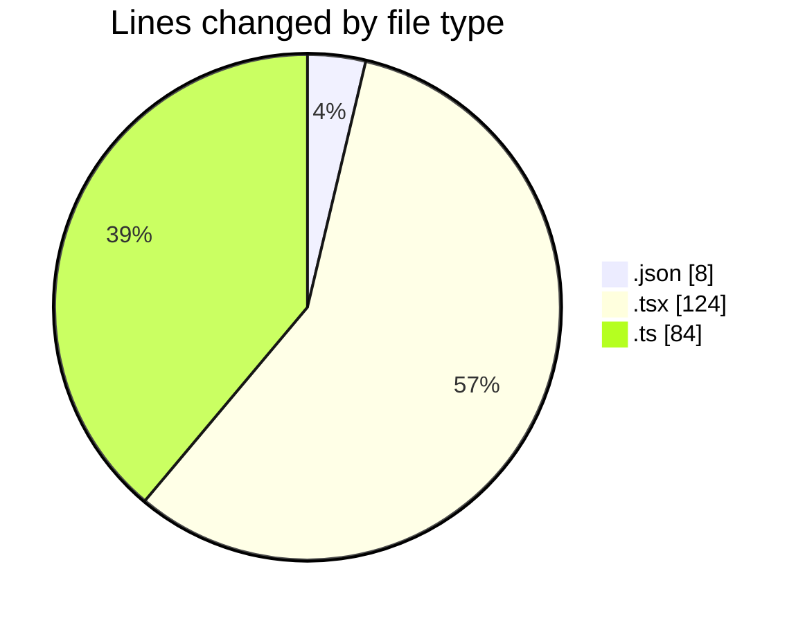
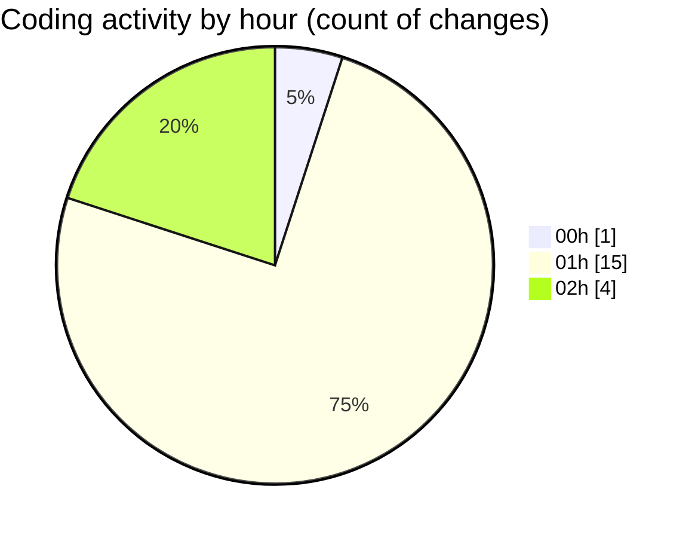

# niten - Activity Summary 

## Overall Statistics

| Stat                   | Value                                                             |
| ---------------------- | ----------------------------------------------------------------- |
| **Lines Added** (➕)   | 177                                          |
| **Lines Removed** (➖) | 39                                        |
| **Net Change** (↕)    | 138                |
| **Active Time** (⌚)   | 21 minutes |

## Modified Files
- **package.json** (+4, -4)
- **page.tsx** (+12, -12)
- **next.config.ts** (+35, -10)
- **ServiceGrid.tsx** (+87, -13)
- **services.ts** (+28, -0)
- **next-intl.config.ts** (+11, -0)

## Visualizations

### By File Type (Lines Changed)

### By Hour (Estimated Activity Count)

> **Last Updated:** 5/1/2025, 2:12:36 AM