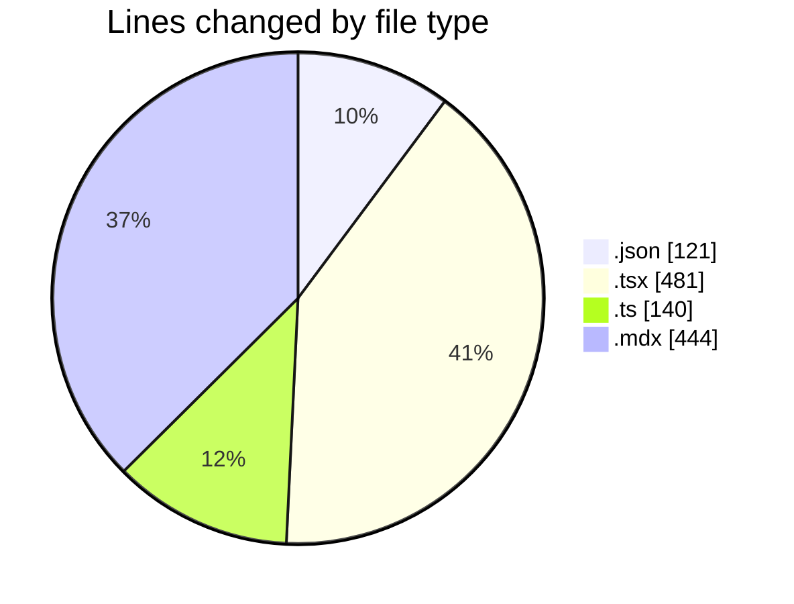
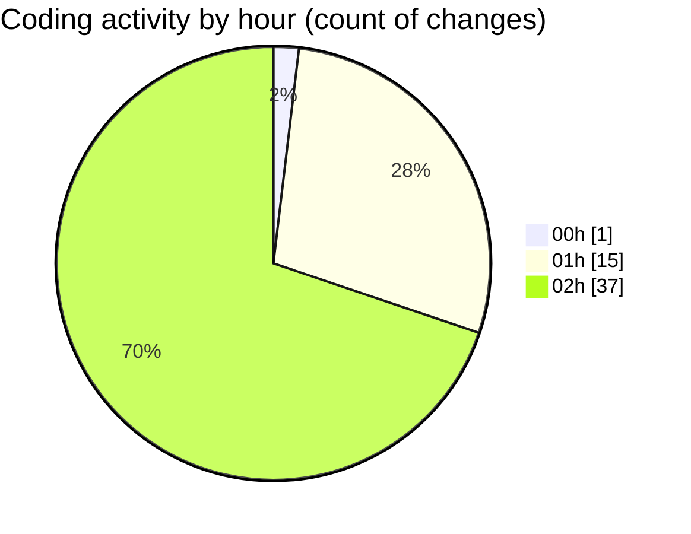

# niten - Activity Summary 

## Overall Statistics

| Stat                   | Value                                                             |
| ---------------------- | ----------------------------------------------------------------- |
| **Lines Added** (➕)   | 830                                          |
| **Lines Removed** (➖) | 356                                        |
| **Net Change** (↕)    | 474                |
| **Active Time** (⌚)   | 62 minutes |

## Modified Files
- **package.json** (+6, -6)
- **page.tsx** (+12, -12)
- **next.config.ts** (+35, -22)
- **ServiceGrid.tsx** (+236, -221)
- **services.ts** (+28, -0)
- **next-intl.config.ts** (+11, -0)
- **en.mdx** (+36, -0)
- **fr.mdx** (+36, -0)
- **mdx.d.ts** (+15, -0)
- **services.mdx** (+139, -64)
- **services.mdx** (+141, -0)
- **services.mdx** (+28, -0)
- **en.json** (+91, -18)
- **services.ts** (+16, -13)

## Visualizations

### By File Type (Lines Changed)

### By Hour (Estimated Activity Count)

> **Last Updated:** 5/1/2025, 2:52:36 AM