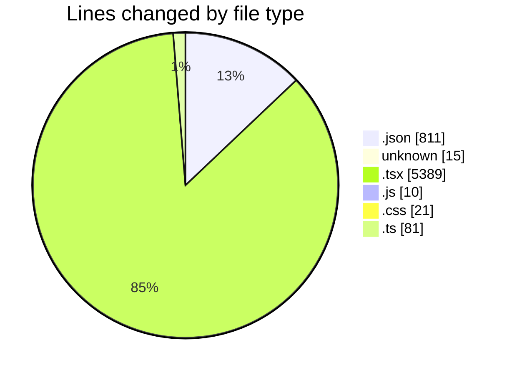
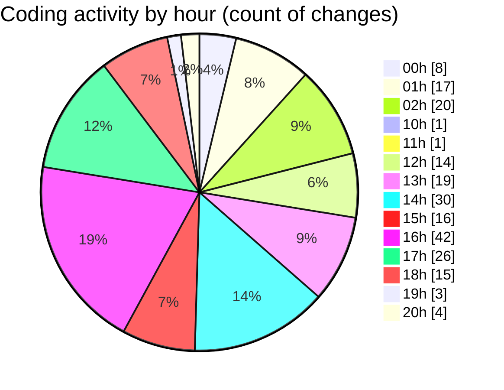

# niten - Activity Summary 

## Overall Statistics

| Stat                   | Value                                                             |
| ---------------------- | ----------------------------------------------------------------- |
| **Lines Added** (➕)   | 5155                                          |
| **Lines Removed** (➖) | 1172                                        |
| **Net Change** (↕)    | 3983                |
| **Active Time** (⌚)   | 328 minutes |

## Modified Files
- **package.json** (+73, -2)
- **pre-commit** (+8, -4)
- **layout.tsx** (+24, -0)
- **tailwind.config.js** (+10, -0)
- **Hero.tsx** (+255, -74)
- **layout.tsx** (+14, -0)
- **globals.css** (+10, -6)
- **globals.css** (+5, -0)
- **Navbar.tsx** (+165, -8)
- **CountUp.tsx** (+262, -64)
- **Features.tsx** (+161, -6)
- **button.tsx** (+59, -0)
- **Testimonials.tsx** (+691, -638)
- **Footer.tsx** (+290, -0)
- **ServiceCard.tsx** (+113, -0)
- **ServiceGrid.tsx** (+68, -0)
- **testimonials.ts** (+11, -0)
- **TestimonialsCarousel.tsx** (+148, -147)
- **TestimonialsAnimation.tsx** (+169, -0)
- **home.json** (+83, -0)
- **home.json** (+83, -0)
- **StatsSection.tsx** (+44, -0)
- **getTranslation.ts** (+7, -0)
- **FeatureIcons.tsx** (+17, -0)
- **LanguageSwitcher.tsx** (+49, -0)
- **page.tsx** (+72, -11)
- **page.tsx** (+103, -17)
- **projects.json** (+74, -0)
- **ProjectGrid.tsx** (+99, -2)
- **ProjectCard.tsx** (+117, -4)
- **request.ts** (+62, -1)
- **projects.json** (+76, -0)
- **about.json** (+69, -5)
- **about.json** (+68, -4)
- **StatsSection.tsx** (+41, -2)
- **Constants.tsx** (+130, -120)
- **HeroSection.tsx** (+43, -0)
- **StorySection.tsx** (+46, -0)
- **ValuesSection.tsx** (+49, -0)
- **TeamSection.tsx** (+58, -4)
- **CTASection.tsx** (+36, -2)
- **careers.json** (+63, -3)
- **careers.json** (+62, -2)
- **page.tsx** (+268, -20)
- **.prettierignore** (+3, -0)
- **.eslintrc.json** (+23, -11)
- **.prettierrc.json** (+11, -1)
- **common.json** (+24, -13)
- **page.tsx** (+678, -1)
- **contact.json** (+31, -0)
- **contact.json** (+30, -0)

## Visualizations

### By File Type (Lines Changed)

### By Hour (Estimated Activity Count)

> **Last Updated:** 5/2/2025, 8:12:57 PM