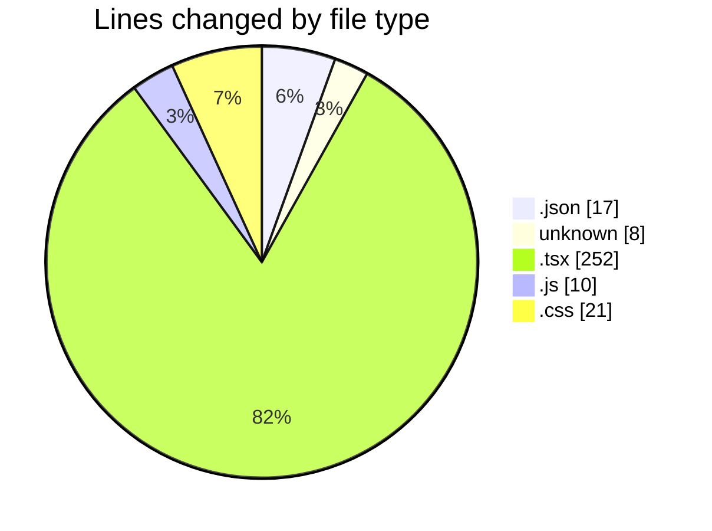
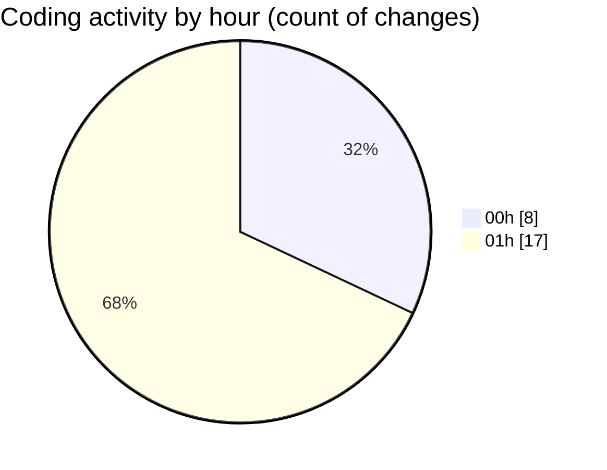

# niten - Activity Summary 

## Overall Statistics

| Stat                   | Value                                                             |
| ---------------------- | ----------------------------------------------------------------- |
| **Lines Added** (➕)   | 298                                          |
| **Lines Removed** (➖) | 10                                        |
| **Net Change** (↕)    | 288                |
| **Active Time** (⌚)   | 45 minutes |

## Modified Files
- **package.json** (+17, -0)
- **pre-commit** (+4, -4)
- **layout.tsx** (+24, -0)
- **tailwind.config.js** (+10, -0)
- **Hero.tsx** (+57, -0)
- **layout.tsx** (+14, -0)
- **globals.css** (+10, -6)
- **globals.css** (+5, -0)
- **Navbar.tsx** (+157, -0)

## Visualizations

### By File Type (Lines Changed)

### By Hour (Estimated Activity Count)

> **Last Updated:** 5/2/2025, 2:00:46 AM