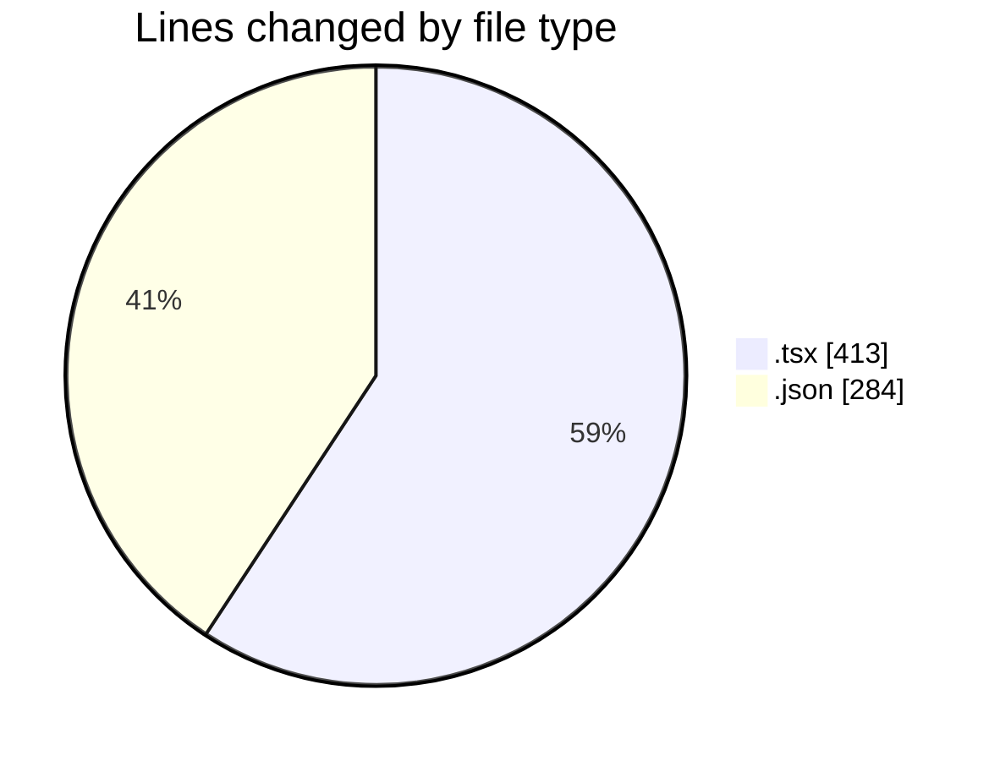
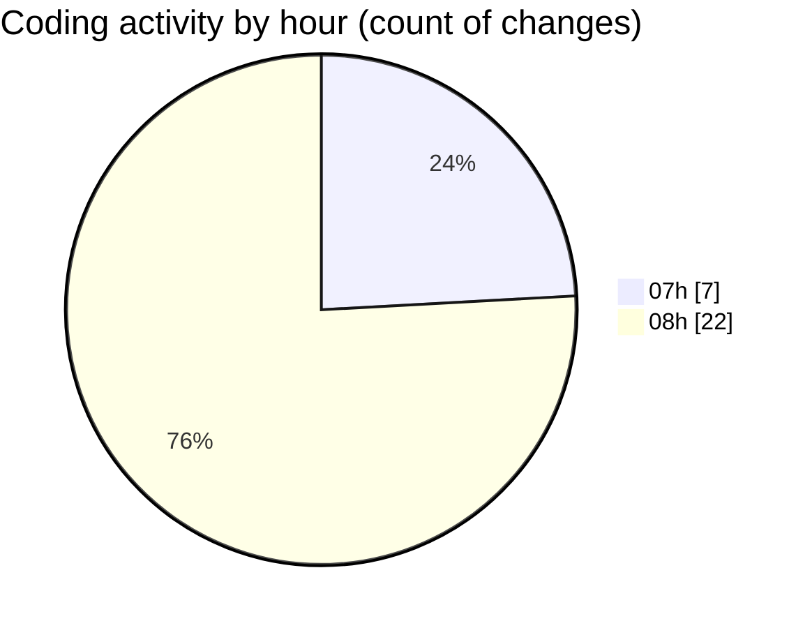

# niten - Activity Summary 

## Overall Statistics

| Stat                   | Value                                                             |
| ---------------------- | ----------------------------------------------------------------- |
| **Lines Added** (➕)   | 693                                          |
| **Lines Removed** (➖) | 4                                        |
| **Net Change** (↕)    | 689                |
| **Active Time** (⌚)   | 29 minutes |

## Modified Files
- **MapComponent.tsx** (+49, -0)
- **page.tsx** (+59, -0)
- **settings.json** (+107, -2)
- **services.json** (+84, -0)
- **services.json** (+84, -0)
- **page.tsx** (+81, -0)
- **ServiceCard.tsx** (+119, -0)
- **page.tsx** (+63, -1)
- **not-found.tsx** (+40, -1)
- **notfound.json** (+6, -0)
- **notfound.json** (+1, -0)

## Visualizations

### By File Type (Lines Changed)

### By Hour (Estimated Activity Count)

> **Last Updated:** 5/4/2025, 8:57:31 AM