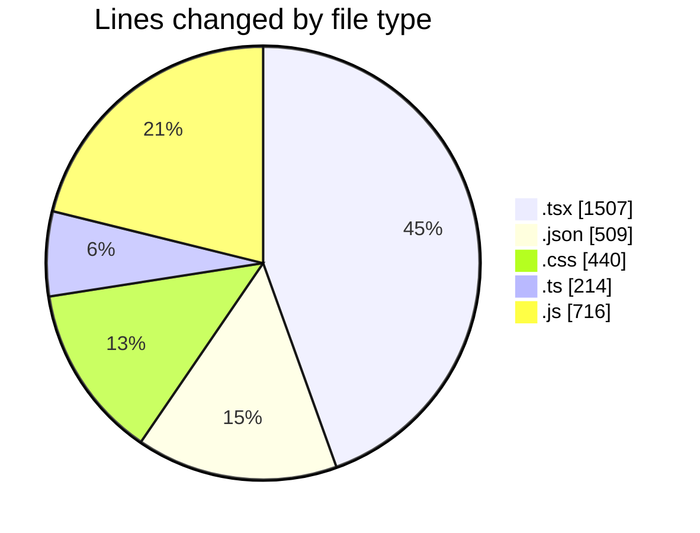
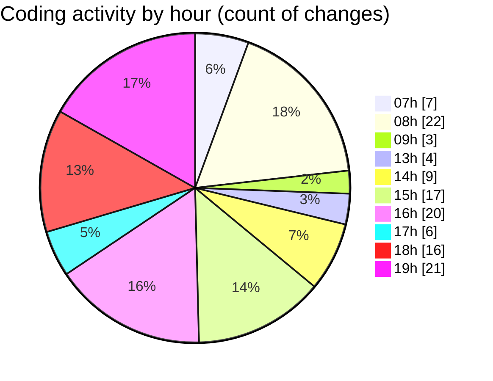

# niten - Activity Summary 

## Overall Statistics

| Stat                   | Value                                                             |
| ---------------------- | ----------------------------------------------------------------- |
| **Lines Added** (➕)   | 3050                                          |
| **Lines Removed** (➖) | 336                                        |
| **Net Change** (↕)    | 2714                |
| **Active Time** (⌚)   | 183 minutes |

## Modified Files
- **MapComponent.tsx** (+49, -0)
- **page.tsx** (+59, -0)
- **settings.json** (+107, -2)
- **services.json** (+185, -0)
- **services.json** (+185, -0)
- **page.tsx** (+180, -2)
- **ServiceCard.tsx** (+239, -1)
- **page.tsx** (+124, -1)
- **not-found.tsx** (+126, -47)
- **notfound.json** (+6, -0)
- **notfound.json** (+1, -0)
- **package.json** (+3, -2)
- **not-found.tsx** (+114, -81)
- **not-found.css** (+163, -65)
- **middleware.ts** (+59, -37)
- **request.ts** (+35, -4)
- **routing.ts** (+42, -5)
- **[[sllug]].js** (+20, -0)
- **error.json** (+9, -0)
- **error.json** (+9, -0)
- **not-found.css** (+32, -0)
- **button.tsx** (+58, -0)
- **ProjectCard.tsx** (+113, -1)
- **style.css** (+8, -4)
- **tailwind.config.js** (+140, -0)
- **Component.js** (+556, -0)
- **ServiceHero.tsx** (+121, -51)
- **ServiceFeatures.tsx** (+44, -0)
- **SpotlightCard.tsx** (+83, -13)
- **serviceImages.ts** (+32, -0)
- **globals.css** (+148, -20)

## Visualizations

### By File Type (Lines Changed)

### By Hour (Estimated Activity Count)

> **Last Updated:** 5/4/2025, 7:47:58 PM