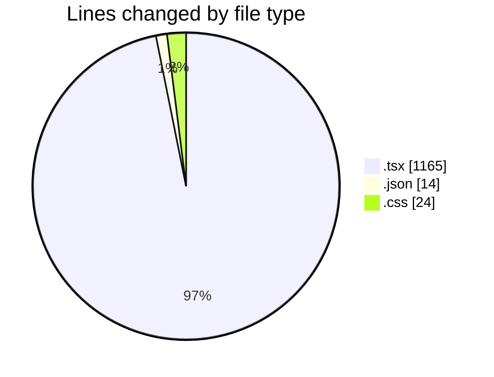
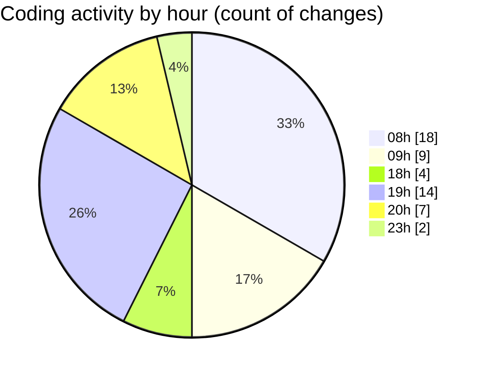

# niten - Activity Summary 

## Overall Statistics

| Stat                   | Value                                                             |
| ---------------------- | ----------------------------------------------------------------- |
| **Lines Added** (➕)   | 868                                          |
| **Lines Removed** (➖) | 335                                        |
| **Net Change** (↕)    | 533                |
| **Active Time** (⌚)   | 67 minutes |

## Modified Files
- **Hero.tsx** (+51, -42)
- **Footer.tsx** (+147, -0)
- **Testimonials.tsx** (+54, -0)
- **page.tsx** (+59, -0)
- **page.tsx** (+23, -3)
- **navigation.json** (+11, -0)
- **AOSInit.tsx** (+17, -2)
- **layout.tsx** (+2, -0)
- **AnimatedSection.tsx** (+33, -0)
- **AnimatedSection.css** (+24, -0)
- **Features.tsx** (+17, -0)
- **SignInPage.tsx** (+267, -204)
- **page.tsx** (+17, -5)
- **package.json** (+3, -0)
- **layout.tsx** (+100, -79)
- **layout.tsx** (+43, -0)

## Visualizations

### By File Type (Lines Changed)

### By Hour (Estimated Activity Count)

> **Last Updated:** 5/5/2025, 8:16:05 PM