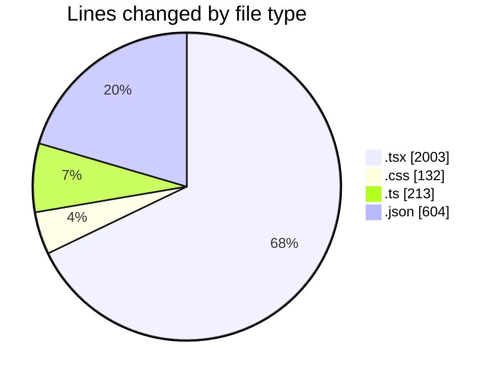
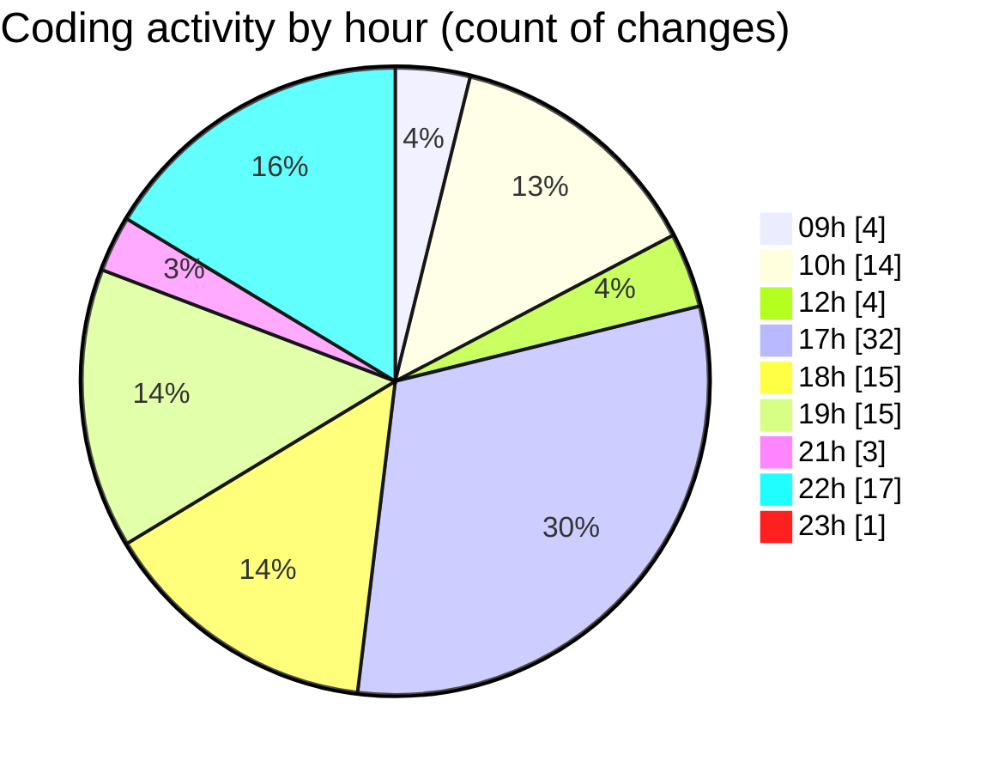

# niten - Activity Summary 

## Overall Statistics

| Stat                   | Value                                                             |
| ---------------------- | ----------------------------------------------------------------- |
| **Lines Added** (➕)   | 2911                                          |
| **Lines Removed** (➖) | 41                                        |
| **Net Change** (↕)    | 2870                |
| **Active Time** (⌚)   | 121 minutes |

## Modified Files
- **layout.tsx** (+63, -7)
- **page.tsx** (+130, -0)
- **ServiceHero.tsx** (+198, -0)
- **SignInPage.tsx** (+170, -13)
- **globals.css** (+130, -2)
- **page.tsx** (+1, -0)
- **middleware.ts** (+46, -0)
- **project.ts** (+13, -0)
- **services.ts** (+18, -0)
- **LangSwitch.tsx** (+22, -0)
- **Switcher.tsx** (+137, -0)
- **request.ts** (+32, -0)
- **routing.ts** (+82, -0)
- **AOSInit.tsx** (+15, -0)
- **useScrollPosition.ts** (+22, -0)
- **ServiceGrid.tsx** (+66, -0)
- **ServiceCard.tsx** (+119, -0)
- **ServiceFeatures.tsx** (+45, -0)
- **services.json** (+187, -0)
- **services.json** (+187, -0)
- **Hero.tsx** (+113, -0)
- **auth.json** (+27, -0)
- **auth.json** (+27, -0)
- **Features.tsx** (+94, -12)
- **page.tsx** (+22, -0)
- **JoinTeamForm.tsx** (+110, -0)
- **HeroSection.tsx** (+93, -1)
- **page.tsx** (+78, -4)
- **ApplicationForm.tsx** (+292, -1)
- **careers.json** (+76, -0)
- **careers.json** (+76, -0)
- **Navbar.tsx** (+196, -1)
- **navigation.json** (+12, -0)
- **navigation.json** (+12, -0)

## Visualizations

### By File Type (Lines Changed)

### By Hour (Estimated Activity Count)

> **Last Updated:** 5/6/2025, 11:14:31 PM