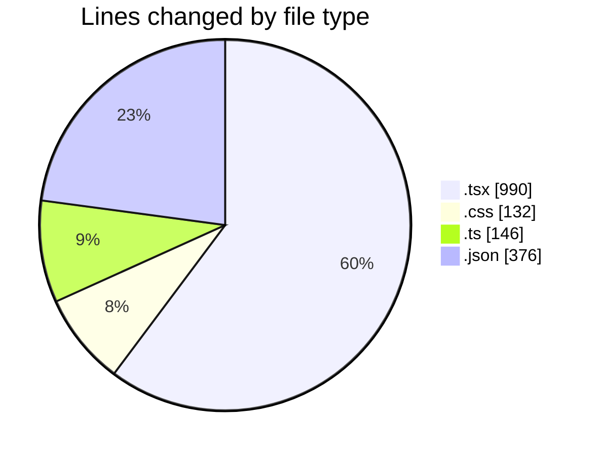
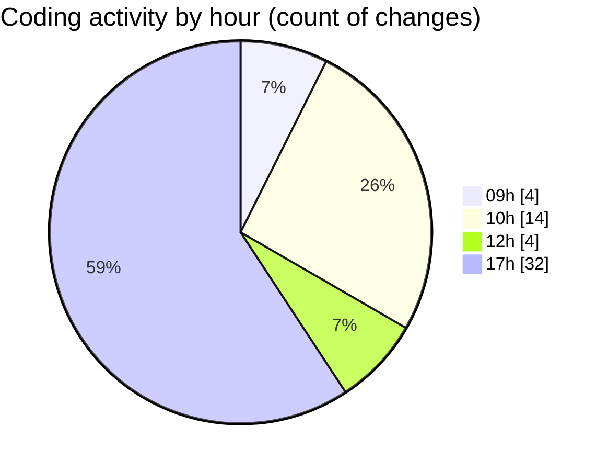

# niten - Activity Summary 

## Overall Statistics

| Stat                   | Value                                                             |
| ---------------------- | ----------------------------------------------------------------- |
| **Lines Added** (➕)   | 1623                                          |
| **Lines Removed** (➖) | 21                                        |
| **Net Change** (↕)    | 1602                |
| **Active Time** (⌚)   | 58 minutes |

## Modified Files
- **layout.tsx** (+31, -7)
- **page.tsx** (+64, -0)
- **ServiceHero.tsx** (+198, -0)
- **SignInPage.tsx** (+166, -12)
- **globals.css** (+130, -2)
- **page.tsx** (+1, -0)
- **middleware.ts** (+23, -0)
- **project.ts** (+13, -0)
- **services.ts** (+18, -0)
- **LangSwitch.tsx** (+22, -0)
- **Switcher.tsx** (+137, -0)
- **request.ts** (+31, -0)
- **routing.ts** (+39, -0)
- **AOSInit.tsx** (+15, -0)
- **useScrollPosition.ts** (+22, -0)
- **ServiceGrid.tsx** (+66, -0)
- **ServiceCard.tsx** (+119, -0)
- **ServiceFeatures.tsx** (+45, -0)
- **services.json** (+187, -0)
- **services.json** (+187, -0)
- **Hero.tsx** (+107, -0)
- **auth.json** (+1, -0)
- **auth.json** (+1, -0)

## Visualizations

### By File Type (Lines Changed)

### By Hour (Estimated Activity Count)

> **Last Updated:** 5/6/2025, 5:52:03 PM