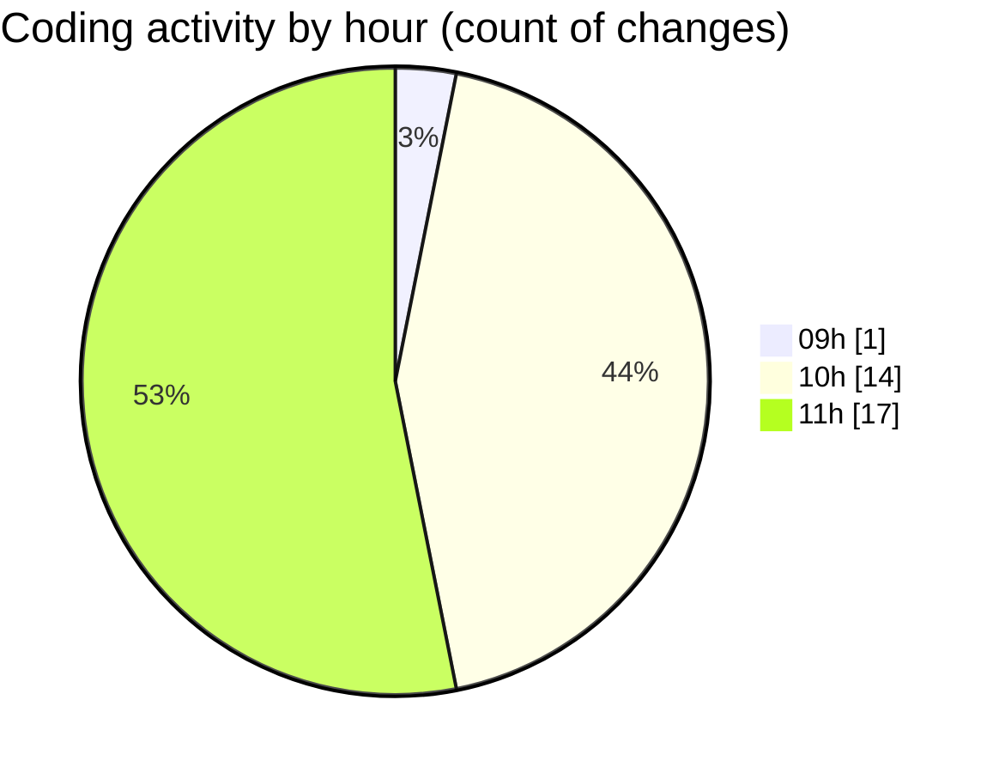

# niten - Activity Summary 

## Overall Statistics

| Stat                   | Value                                                             |
| ---------------------- | ----------------------------------------------------------------- |
| **Lines Added** (➕)   | 1121                                          |
| **Lines Removed** (➖) | 83                                        |
| **Net Change** (↕)    | 1038                |
| **Active Time** (⌚)   | 33 minutes |

## Modified Files
- **page.tsx** (+14, -0)
- **Hero.tsx** (+113, -0)
- **Features.tsx** (+82, -0)
- **layout.tsx** (+60, -2)
- **ProjectCard.tsx** (+115, -0)
- **page.tsx** (+21, -0)
- **AOSProvider.tsx** (+23, -0)
- **ServiceCard.tsx** (+127, -8)
- **ServiceGrid.tsx** (+69, -3)
- **ServiceHero.tsx** (+128, -23)
- **page.tsx** (+115, -37)
- **page.tsx** (+118, -10)
- **SubFeatureSection.tsx** (+89, -0)
- **AOSInit.tsx** (+47, -0)

## Visualizations

### By File Type (Lines Changed)

### By Hour (Estimated Activity Count)

> **Last Updated:** 5/7/2025, 11:36:57 AM