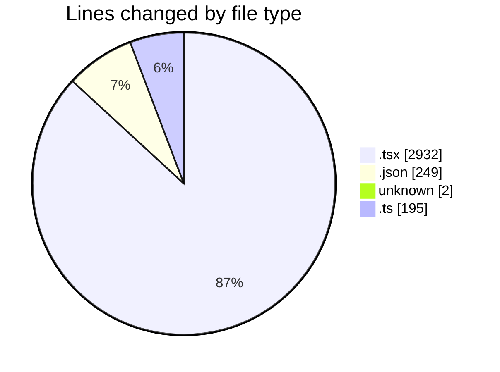
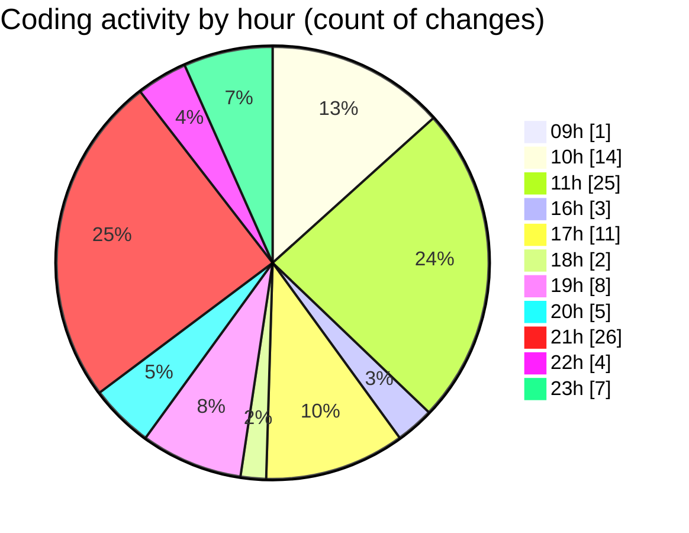

# niten - Activity Summary 

## Overall Statistics

| Stat                   | Value                                                             |
| ---------------------- | ----------------------------------------------------------------- |
| **Lines Added** (➕)   | 3085                                          |
| **Lines Removed** (➖) | 293                                        |
| **Net Change** (↕)    | 2792                |
| **Active Time** (⌚)   | 116 minutes |

## Modified Files
- **page.tsx** (+14, -0)
- **Hero.tsx** (+113, -0)
- **Features.tsx** (+82, -0)
- **layout.tsx** (+185, -63)
- **ProjectCard.tsx** (+236, -2)
- **page.tsx** (+21, -0)
- **AOSProvider.tsx** (+23, -0)
- **ServiceCard.tsx** (+127, -8)
- **ServiceGrid.tsx** (+69, -3)
- **ServiceHero.tsx** (+128, -23)
- **page.tsx** (+183, -47)
- **page.tsx** (+118, -10)
- **SubFeatureSection.tsx** (+89, -0)
- **AOSInit.tsx** (+47, -0)
- **ProjectGrid.tsx** (+198, -6)
- **page.tsx** (+188, -0)
- **HeroSection.tsx** (+60, -0)
- **ValuesSection.tsx** (+53, -0)
- **TeamSection.tsx** (+58, -0)
- **StorySection.tsx** (+48, -0)
- **CTASection.tsx** (+48, -0)
- **page.tsx** (+294, -32)
- **package.json** (+3, -2)
- **.env** (+2, -0)
- **ApplicationForm.tsx** (+154, -10)
- **careers.json** (+79, -3)
- **careers.json** (+79, -3)
- **SignInPage.tsx** (+178, -14)
- **auth.json** (+36, -4)
- **auth.json** (+36, -4)
- **email.ts** (+62, -31)
- **contactActions.ts** (+45, -0)
- **contact.ts** (+29, -28)

## Visualizations

### By File Type (Lines Changed)

### By Hour (Estimated Activity Count)

> **Last Updated:** 5/7/2025, 11:46:17 PM