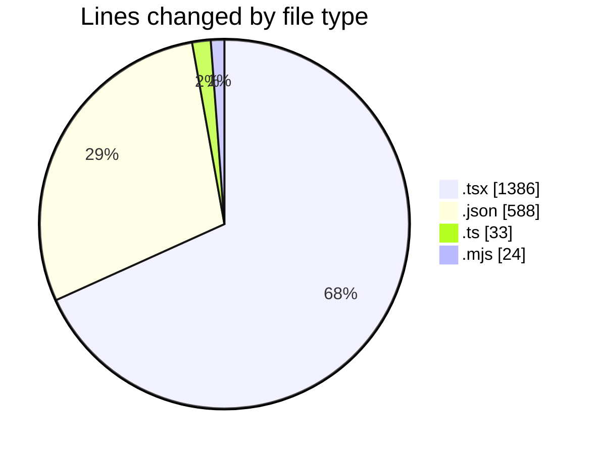
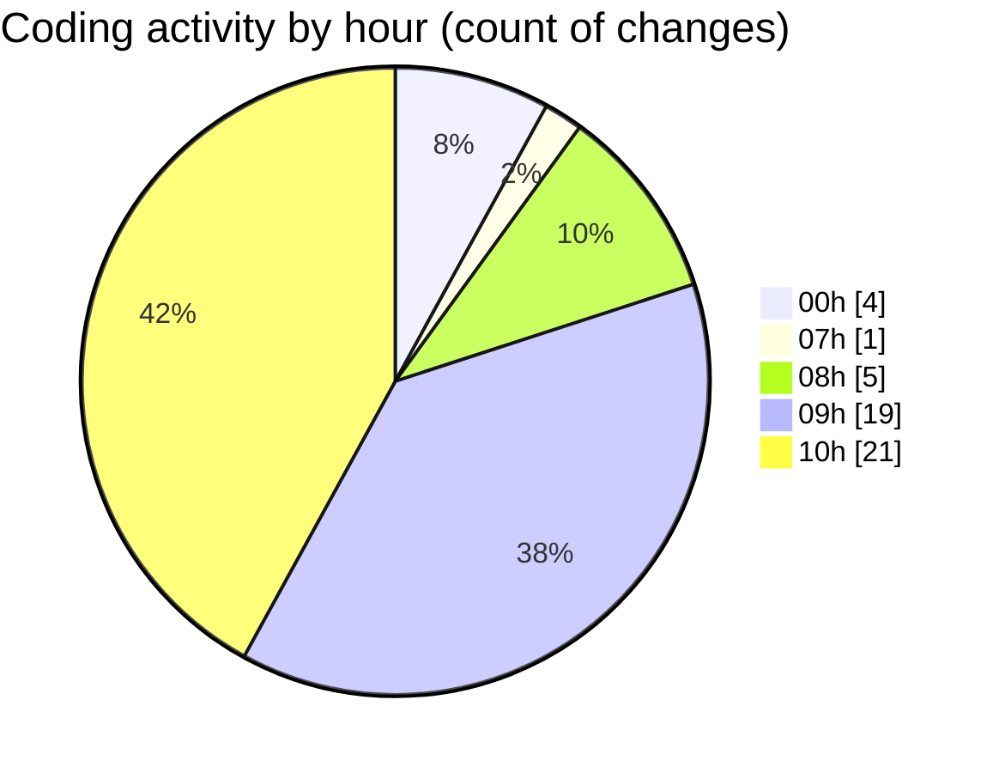

# niten - Activity Summary 

## Overall Statistics

| Stat                   | Value                                                             |
| ---------------------- | ----------------------------------------------------------------- |
| **Lines Added** (➕)   | 1611                                          |
| **Lines Removed** (➖) | 420                                        |
| **Net Change** (↕)    | 1191                |
| **Active Time** (⌚)   | 43 minutes |

## Modified Files
- **page.tsx** (+649, -126)
- **en.json** (+18, -17)
- **ApplicationForm.tsx** (+196, -14)
- **ja.json** (+1, -0)
- **careers.json** (+101, -14)
- **careers.json** (+101, -14)
- **page.tsx** (+326, -75)
- **jobPostings.json** (+82, -81)
- **jobPostings.json** (+80, -79)
- **request.ts** (+33, -0)
- **next.config.mjs** (+24, -0)

## Visualizations

### By File Type (Lines Changed)

### By Hour (Estimated Activity Count)

> **Last Updated:** 5/8/2025, 10:41:04 AM