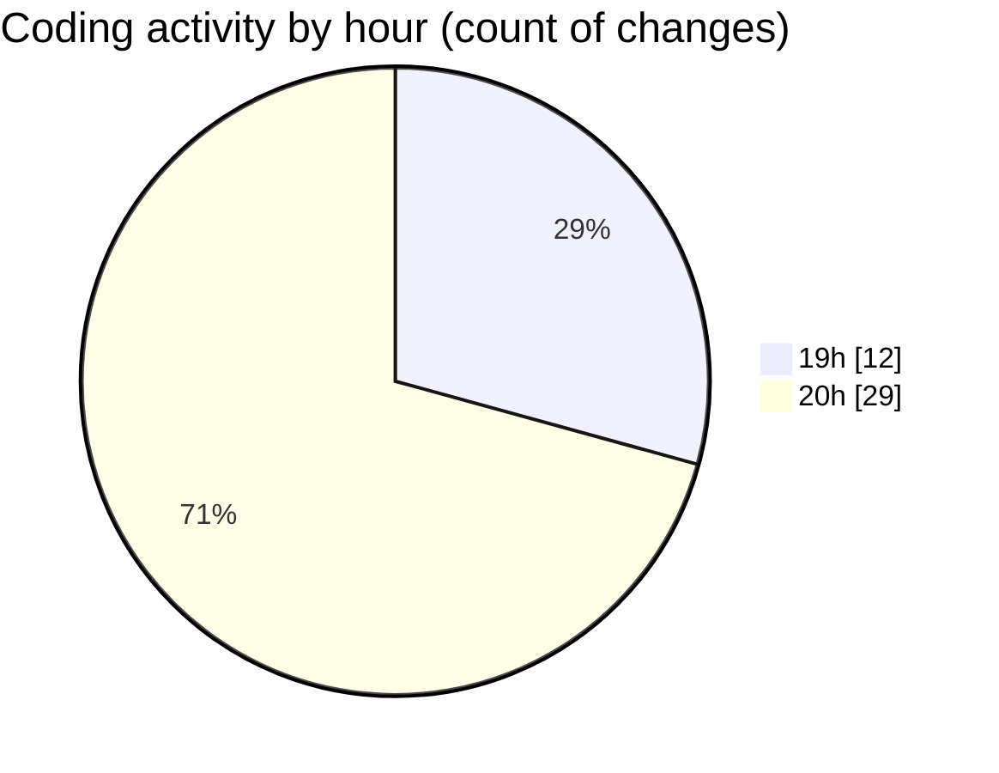

# un_laala - Activity Summary 

## Overall Statistics

| Stat                   | Value                                                             |
| ---------------------- | ----------------------------------------------------------------- |
| **Lines Added** (➕)   | 986                                          |
| **Lines Removed** (➖) | 201                                        |
| **Net Change** (↕)    | 785                |
| **Active Time** (⌚)   | 66 minutes |

## Modified Files
- **collection.json** (+131, -5)
- **page.tsx** (+402, -42)
- **laala.json** (+56, -14)
- **MediaModal.tsx** (+169, -57)
- **MediaViewer.tsx** (+149, -83)
- **next.config.ts** (+31, -0)
- **formatMediaItems.ts** (+48, -0)

## Visualizations

### By File Type (Lines Changed)

### By Hour (Estimated Activity Count)

> **Last Updated:** 5/9/2025, 8:52:33 PM