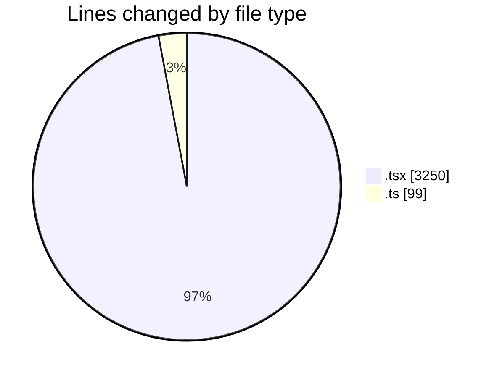

# Elitesun - Activity Summary 

## Overall Statistics

| Stat                   | Value                                                             |
| ---------------------- | ----------------------------------------------------------------- |
| **Lines Added** (➕)   | 2328                                          |
| **Lines Removed** (➖) | 1021                                        |
| **Net Change** (↕)    | 1307                |
| **Active Time** (⌚)   | 23 minutes |

## Modified Files
- **Logo.tsx** (+233, -116)
- **LetterFx.tsx** (+333, -192)
- **Icon.tsx** (+209, -90)
- **HoloFx.tsx** (+323, -163)
- **GlitchFx.tsx** (+222, -112)
- **DropdownWrapper.tsx** (+425, -207)
- **icons.ts** (+91, -8)
- **Projects.tsx** (+77, -40)
- **ProjectCard.tsx** (+180, -93)
- **Header.tsx** (+235, -0)

## Visualizations

### By File Type (Lines Changed)

### By Hour (Estimated Activity Count)

> **Last Updated:** 5/10/2025, 3:41:06 PM